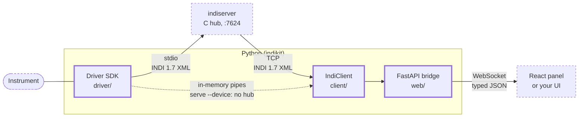

# CLAUDE.md

Guidance for Claude Code (claude.ai/code) when working in this repository.

This file is what holds everywhere. Per-area detail lives beside the code it describes and
is **loaded on demand**: read the scoped file for the area you are about to change, not all
of them.

| Changing | Read first |
|---|---|
| the Python package: protocol, driver SDK, client, web bridge, CLI | `src/indikit/CLAUDE.md` |
| the TypeScript workspace: libraries, panel, doc demos | `web/CLAUDE.md` |
| commands and workflows | `DEVELOPMENT.md` (keep it in step when either changes) |
| anything already known to be wrong or deferred | `CONCERNS.md` (read before starting, prune when you fix one) |

`CONCERNS.md` is the register of what is known to be broken, unfinished or deliberately
deferred. **Read it before starting work** - the thing you are about to investigate may
already be in there with the reason. **When you resolve one, delete the entry** in the same
commit that resolves it, rather than marking it done: git remembers, and a register that
accumulates history is one nobody trusts. Add an entry when you leave something undone on
purpose, and say what resolving it would look like.

## Project overview

INDIkit (`indikit`) is a modern, typed Python framework for the
[INDI protocol](https://docs.indilib.org/protocol/) (astronomical instrument control): the
driver SDK, the async client, and the web bridge, on a Pydantic v2 + FastAPI foundation
with a TypeScript/React frontend. It does **not** reimplement the C `indiserver` binary.

Docs publish to <https://indikit.sidereal.software/> from `main` via
`.github/workflows/docs.yml`.

## Locked architectural decisions

Decided at project start; do not revisit without explicit direction.

1. **`indiserver` stays the hub.** Drivers run as its stdio children; the web layer is a TCP
   client of it. We modernize only the Python and frontend layers.
2. **Dual protocol.** INDI 1.7 **XML** on the `indiserver` wire (ecosystem interop); typed
   **JSON** to browsers.
3. **Monorepo.** `src/indikit/` plus a `pnpm` workspace under `web/`. INDI 1.7 is frozen,
   so the browser wire types are **hand-authored** TypeScript mirroring the Pydantic models
   (no codegen). Keep them in step when the protocol models change.
4. **Frontend is TypeScript + React (Vite) over WebSockets, styled with shadcn/ui**, shipped
   in three layers: `@indikit/client`, `@indikit/react`, and a reference panel app.
   Both "batteries-included app" and "build your own UI" are first-class.

## Commands

This project uses [uv](https://docs.astral.sh/uv/). Run everything through it.

```bash
uv venv --python 3.12           # create the venv (first time)
uv pip install -e ".[dev]"      # install package + dev deps

uv run pytest                   # run tests
uv run ruff check src tests examples hatch_build.py     # lint (the set CI checks)
uv run ruff format src tests examples hatch_build.py    # format
uv run mypy src                 # type-check (strict)

# After an intentional protocol-model change: regenerate the golden wire schema,
# and update web/packages/client/src/types.ts in the same commit.
INDIKIT_UPDATE_GOLDEN=1 uv run pytest tests/test_wire_contract.py

# The interop suite: a real indiserver, real libindi C++ drivers and a real browser.
# `uv run pytest` excludes it and it skips itself when indiserver is not on PATH, so
# on macOS it is silently never run. Run it in the container the repository already
# ships - same Ubuntu 24.04 and same distro libindi as the nightly job, so it
# reproduces that job rather than approximating it:
docker compose --profile interop run --rm --build interop
docker compose --profile interop run --rm interop pytest tests/interop/test_blob.py -q  # narrowed
```

Frontend commands run from `web/`: `pnpm -r build`, `pnpm -r typecheck`, `pnpm -r test`,
`pnpm lint`, `pnpm run lint:diagrams`.

**Green baseline before any commit:** `ruff check` and `ruff format --check` clean,
`mypy src` clean, `pytest` passing, and the frontend five if you touched `web/`. New work
lands with its own tests.

**Run the interop suite locally, and do not wait for the nightly to tell you.** It is the
only thing here that puts a real libindi on the other side of the wire, so it is the only
thing that can catch a deviation from the spec - and because it skips itself without
`indiserver`, a green local run proves nothing about it. Run the container when you touch
`protocol/`, `client/`, `tests/interop/`, or **the markup the panel renders**. The first
three are what its workflow watches; the fourth is not, and that is the gap that has
already cost a red nightly: changing a switch vector from a radio group to toggle buttons
was correct, and it broke an interop selector that neither `pytest` nor the frontend five
could see, because the only test that drives the real panel lives behind `indiserver`.

**Check the nightly rather than assuming it is green.** `gh run list --workflow interop
--limit 3` is the whole check. It is deliberately off the pull-request path, so nothing
blocks a merge on it and a failure is easy to carry for days without noticing - it had
been red for two nights before anyone looked.

## How to work here

- **Prefer quality over cost.** Weigh simplicity, robustness, scalability and long-term
  maintainability; development effort is not the deciding factor.
- **Simplest direct path first.** For one-off or infrequent work, do the thing end to end.
  Do not add wrappers, control planes, policy layers, custom verifiers or automation until
  the direct path exposes a concrete blocker or a repeated need.
- **Reproduce before fixing.** Start a bug fix by reproducing it end to end, as close to how
  a user hits it as possible. A fix for a bug you never reproduced usually fixes something
  else.
- **Be picky about the UI.** When testing a product end to end, hold out for pixel
  perfection. If something looks off, fix it even when it is not what you were sent for.
- **Same bar for engineering hygiene.** Lint failures, test failures and flakiness get fixed
  when you see them, whoever caused them.
- **Never use an em dash.** Use a plain `-`.
- **Never hand-edit `CHANGELOG.md` or any file marked auto-generated**, including
  `docs/reference/typescript/**` (typedoc output).
- **Ask before swarming.** Explain the tradeoffs and get explicit approval before using
  dynamic workflows, ultracode, or anything else that immediately spawns many subagents.

## Git

- **Do not commit or push unless explicitly asked.**
- Conventional Commits (`type(scope): summary`), small and scoped to one piece of work. If a
  ticket ID (e.g. `GPP-123`) is in the branch name or was given in conversation, use it as
  the scope: `fix(GPP-123): ...`.
- Never `git add .`; stage only the files for this task.
- Run the green baseline first, then show `git status --short` and summarize the staged diff.
- **Never add an agent as author or co-author.** Commits are the user's.
- Never amend, rebase, reset, force-push or delete branches without explicit approval.

## Architecture

```
src/indikit/
├── exceptions.py       the error hierarchy: IndiError + a builtin base per type
├── settings.py         the INDIKIT_* environment, read once at an entrypoint
├── logging_config.py   configure_logging + the shared indikit.wire logger
├── protocol/           the INDI 1.7 wire format: models, enums, XML + JSON codecs
├── driver/             driver SDK: subclass a base device; stdio XML under indiserver
├── testing.py          DeviceHarness: drive a Device in a test, no indiserver
├── client/             reconnecting asyncio TCP client to indiserver + property cache
├── transport.py        shared ReadFn/WriteFn/CloseFn byte-stream contract + TCP adapter
├── hub.py              InProcessHub: drivers in this process, standing in for indiserver
├── web/                FastAPI app: WebSocket bridge (INDI <-> JSON, plus the bridge's
│                       own control frames) + REST + panel/debug
└── cli.py              Typer CLI (new / serve / run / monitor)

web/              pnpm workspace: the TypeScript frontend
├── packages/client/     @indikit/client - framework-agnostic transport + property store
├── packages/react/      @indikit/react  - hooks + shadcn/ui components + shared theme
└── apps/panel/          the reference panel, built into src/indikit/web/static/panel/
```

Data flow (unchanged from the INDI model):



### Keeping the diagrams current

A diagram that has drifted from the code is worse than none, because it is believed.
**A change that alters architecture lands with the diagram updates in the same commit.**
That means any change to the components under `src/indikit/` or `web/`, to what flows
between them or on what transport, to the inside of the driver runtime, or to an external
boundary (`indiserver`, the browser, the instrument).

| File | Diagram |
|---|---|
| `CLAUDE.md`, `README.md`, `docs/index.md` | the stack (three byte-identical copies; edit one, copy it to the other two, and diff to confirm) |
| `src/indikit/CLAUDE.md` | the driver runtime internals |

Rendering is wired up already (`pymdownx.superfences` for MkDocs, native on GitHub). Keep
diagrams legible as plain source, and mark anything INDIkit does not own with the shared
`classDef ext`.

Two rules keep them readable everywhere they render:

- **No colours in a diagram.** Every one of these appears on GitHub *and* on the docs site,
  each in light *and* dark mode, and each themes the diagram itself. A hardcoded palette
  wins that fight and loses the page: a light fill lands as a bright island on a dark page
  with unreadable text. Carry meaning in the border - `classDef ours` is thick and solid,
  `classDef ext` is thin and dashed - which survives any theme and never leans on colour
  alone.
- **No HTML in a node label** beyond `<br/>`. Labels render as real DOM, so `<code>`,
  `<b>` and `<i>` inherit the surrounding site's CSS: on the docs site `<code>` picked up
  the theme's code colour and the label text went orange on an orange fill.

`pnpm run lint:diagrams` (in `web/`, also run by CI) parses every diagram in the repository
with Mermaid's own parser, so a broken one fails the build instead of rendering as an empty
box.

Purely internal refactors need no diagram edit; say so in the commit body rather than
silently skipping it.

## Conventions

- Python 3.12+ floor, line length 100, ruff rules `E,F,I,UP,B,SIM,ASYNC,D`. Use the stdlib
  directly (`enum.StrEnum`, `asyncio.TaskGroup`, `asyncio.timeout`); no back-compat shims,
  no third-party async layers.
- `mypy --strict` passes on `src`, and every public signature there is fully annotated. Test
  code does not need annotated signatures.
- Inline comments carry the local "why" behind a non-obvious line, never a restatement of
  the signature or docstring.
- New wire behavior gets a round-trip test in `tests/test_protocol.py` (serialize -> parse
  -> assert); streaming behavior gets a chunk-boundary test.
- A change to a protocol model or a bridge control frame also fails
  `tests/test_wire_contract.py` against the golden `tests/data/wire_schema.json`.
  Regenerate it with the command above **in the same commit as the `types.ts` mirror** -
  that pairing is the whole point of the golden file. See `DEVELOPMENT.md`.
- Touching the protocol means keeping XML and JSON serialization consistent. The models are
  the shared contract with the frontend.

### Docstrings

**Numpydoc style** (per the [LSST DM guide](https://developer.lsst.io/python/numpydoc.html))
on **every** module, class and function, including private (`_x`), dunder and tests, so
mkdocstrings renders the API reference from source. Ruff's `D` rules enforce the shape; the
rules below are the ones most easily gotten wrong.

- **One entry per parameter.** Never combine names (`label, group : ...` is wrong).
- Each entry is `name : type` with the type as **plain text, not backticked**: `name : str`,
  not ``name : `str` ``. Short type names (`IPState`), `list of X`, `X or None`. Append
  `, optional` when the parameter has a default. The description indents underneath.
- Types appear in docstrings even though the signature is annotated: the signature is the
  checker's truth, the docstring type is what renders in the docs.
- `Returns` / `Yields` use the same `name : type` form; `Raises` lists the exception type
  with an indented description. Do not document `self`.
- Backticks are fine inside description prose (`` `True` ``); the rule is only about the
  type field.
- Imperative mood in the summary line ("Return ...", "Send ...").
