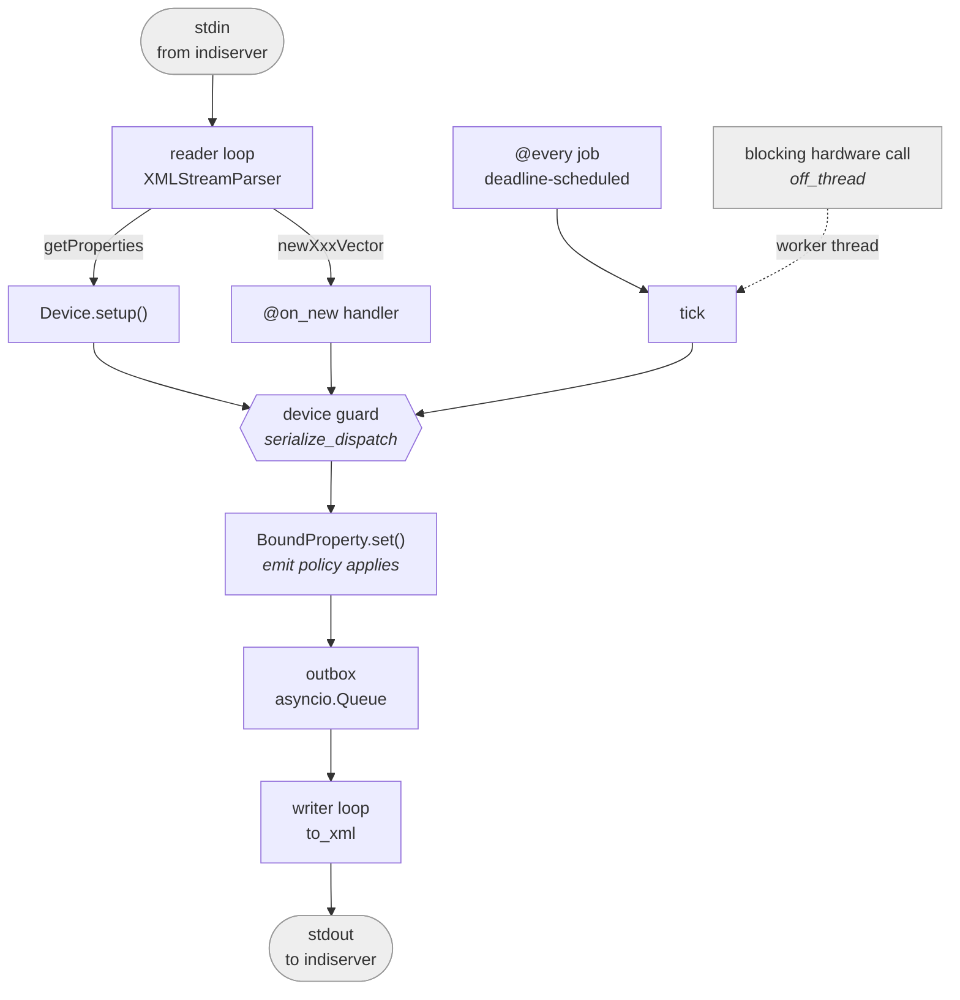

# CLAUDE.md

Guidance for Claude Code (claude.ai/code) when working in this repository.

## Project overview

INDINexus (`indi-nexus`) is a modern, typed Python framework for the
[INDI protocol](http://www.clearskyinstitute.com/INDI/INDI.pdf) (astronomical instrument
control).

INDINexus provides the Python layers of an INDI system - the driver SDK, the async
client, and the web bridge - on a fully-typed Pydantic v2 + FastAPI foundation, with a
TypeScript/React frontend. It does **not** reimplement the C `indiserver` binary.

Docs are published at <https://indi-nexus.sidereal.software/> from `main` by
`.github/workflows/docs.yml`. The full command reference lives in `DEVELOPMENT.md`;
keep it in sync when commands or workflows change.

## Locked architectural decisions

These were decided at project start; do not revisit them without explicit direction.

1. **Keep C `indiserver` as the hub.** Drivers run as stdio children of `indiserver`; the
   web layer is a TCP client of it. We modernize only the Python and frontend layers.
2. **Dual protocol.** Canonical INDI 1.7 **XML** on the `indiserver` wire (interop with the
   wider INDI ecosystem); typed **JSON** to browsers.
3. **Monorepo.** Python package under `src/indi_nexus/` plus a `pnpm` JS workspace under
   `web/`. The wire contract is shared across the boundary. Because INDI 1.7 is frozen, the
   browser-side wire types are **hand-authored** TypeScript mirroring the Pydantic models
   (no codegen); keep them in sync when the protocol models change.
4. **Frontend is TypeScript + React (Vite), over WebSockets, styled with shadcn/ui.**
   Distribution is three layers: `@indi-nexus/client` (framework-agnostic transport +
   property store), `@indi-nexus/react` (hooks + shadcn/ui components + the shared theme),
   and a reference panel app. Both "batteries-included app" and "build your own UI on the
   library" are first-class.

## Commands

This project uses [uv](https://docs.astral.sh/uv/). Run everything through it.

```bash
uv venv --python 3.12           # create the venv (first time)
uv pip install -e ".[dev]"      # install package + dev deps

uv run pytest                   # run tests
uv run pytest -k "name"         # run one test
uv run ruff check src tests     # lint
uv run ruff format src tests    # format
uv run mypy src                 # type-check (strict)
```

**Green baseline before any commit:** `ruff check` clean, `mypy src` clean, `pytest`
passing. New work lands with its own tests; keep that discipline.

## Architecture

**Keep these diagrams current** - see [Architecture diagrams](#architecture-diagrams)
under Conventions.

```
src/indi_nexus/
├── protocol/     the INDI protocol core (see below)
├── driver/       driver SDK: subclass a base device; stdio XML under indiserver
├── testing.py    DeviceHarness: drive a Device in a test, no indiserver
├── client/       reconnecting asyncio TCP client to indiserver + property cache
├── transport.py  shared ReadFn/WriteFn/CloseFn byte-stream contract + TCP adapter
├── web/          FastAPI app: WebSocket bridge (INDI <-> JSON) + REST + panel/debug
└── cli.py        Typer CLI (serve web, run driver, monitor)

web/              pnpm workspace: the TypeScript frontend (see below)
├── packages/client/     @indi-nexus/client - framework-agnostic transport + property store
├── packages/react/      @indi-nexus/react  - hooks + shadcn/ui components + shared theme
└── apps/panel/          the reference panel, built into src/indi_nexus/web/static/panel/
```

Data flow (unchanged from the INDI model):


Inside a running driver - what the runtime owns, and where the device guard sits:



### The protocol layer (`src/indi_nexus/protocol/`)

The single source of truth for the INDI 1.7 wire format: typed models, exact wire-token
enums, and a real streaming parser (no runtime DTD reflection, no "accumulate stdin and
retry `etree.fromstring`" framing loop).

- `enums.py` - `IPState`, `IPerm`, `ISRule`, `ISState`, `BLOBPolicy`. Each subclasses
  `enum.StrEnum`, so a member **is** its exact wire token (`IPState.OK == "Ok"`) and
  Pydantic serializes it directly.
- `models.py` - typed Pydantic models. Key design choices:
  - A **vector** (`NumberVector`, `TextVector`, `SwitchVector`, `LightVector`,
    `BLOBVector`) is the canonical in-memory representation of a property. Discriminated on
    the `kind` field.
  - `def` / `set` / `new` are a wire **intent**, not different data shapes, so they are thin
    event wrappers (`DefVector`, `SetVector`, `NewVector`) around a vector - not five
    duplicated classes each.
  - Element metadata (number `format`/`min`/`max`/`step`, switch `rule`) is optional with
    defaults, because `set`/`one` messages carry only `name` + value. Clients merge `set`
    values onto the previously-defined vector (standard INDI behavior).
  - `LightVector` has no `perm` (lights are always read-only in INDI).
  - Vectors carry pure accessors for handler ergonomics: `element(name)`/`[name]`
    (raising), `get(name, default)` (tolerant; BLOBs yield `data`), `values()`
    (name->value dict), and `SwitchVector.selected()` (first On member of a write).
  - Non-property messages: `GetProperties`, `DelProperty`, `Message`, and `EnableBLOB`
    (`BLOBPolicy` = `Never`/`Also`/`Only`) - a client must send `enableBLOB` before
    `indiserver` forwards any BLOB.
- `xml.py` - the codec.
  - `to_xml(msg)` serializes a message model to canonical INDI XML.
  - `parse_indi(data)` parses a complete chunk; `XMLStreamParser` is the incremental
    parser for a socket/stdio stream (feeds a synthetic root, emits depth-1 elements as
    they complete, clears consumed nodes to keep memory flat).
  - Number values honor the INDI printf `format`, including the `%m` sexagesimal form
    (`format_number` / `parse_number` mirror libindi's `fs_sexa` / `f_scansexa`). This
    matters for RA/Dec interop; `%9.6m` etc. are field-width padded like libindi.
- `json.py` - the JSON codec for browsers. `to_json(msg)` / `from_json(data)` mirror
  `to_xml`/`parse_indi` over a `TypeAdapter(IndiMessage)` (the `tag` literals discriminate
  the union). Same models, so the JSON is the frontend contract; BLOB bytes travel as
  base64 (`ser_json_bytes="base64"` on the base model).

### The driver SDK (`src/indi_nexus/driver/`)

What a driver author subclasses, built on the protocol models. The vocabulary is plain Python
throughout - no libindi-C surface (`IUFind`/`IDSet*`/`IEAddTimer`), no per-tag `ISNew*`
dispatch, no class-global registries.

- `device.py` - `Device`, the base class. Override `async def setup()` to declare
  properties with the `define_number/text/switch/light/blob(...)` helpers (each returns a
  `BoundProperty` typed by the vector kind, and emits the `def`). Access later via
  `self["NAME"]` (untyped in its vector, since a name lookup cannot know the kind) or the
  typed getters `self.number/text/switch/light/blob("NAME")` when you need
  `.vector.elements` to narrow. `self.message()` / `self.log_error()` send INDI
  `message`s. `Device.run()` serves it over stdio.
  `define_connection()` adds the standard `CONNECTION` switch with a built-in handler
  (flip + `on_connect`/`on_disconnect` hooks + announcement); a hook that **raises** rolls
  the switch back to its previous member and leaves the property `Alert` with the reason,
  so a device never claims a link it does not have. `connected` / `require_connected()`
  read the state, and a subclass `@on_new("CONNECTION")` shadows the built-in (the handler
  map keeps the MRO-first entry per property).
  `await self.off_thread(fn, ...)` runs a **blocking** instrument call in a worker thread -
  the answer to the single most common way a real driver goes wrong, since calling a
  synchronous vendor library from an `async def` silently stalls the whole reactor. Only
  the blocking call goes to the thread: the outbox behind `set` is an `asyncio.Queue`, so
  property writes must stay on the loop.
  `serialize_dispatch` (class attribute, default `True`) runs `@every` ticks and `@on_new`
  handlers under one per-device lock, so a tick that awaits mid-flight cannot publish
  pre-write state over a client write that landed while it was out - and hardware access
  is serialised, which one serial port or socket wants anyway.
- `property.py` - `BoundProperty[VectorT]`, the driver-side handle wrapping a (pure)
  protocol vector, generic in the vector so `define_switch(...).vector.elements` is a
  `list[Switch]`. `.set(RA=1.2, DEC=3.4, state=IPState.OK)` mutates elements **and** emits
  one `setXxxVector`; it honors both exclusive switch rules (`OneOfMany` **and**
  `AtMostOne` - turning one On clears siblings). `.select(name, value)` is the whole "one of
  N lights is lit" idiom in one call (name it, siblings reset to the kind's off value, the
  vector takes the selected value's state) - the single most repeated shape in real status
  reporting; `.set_all(value)` writes every element in one emit; `name in prop` asks whether
  hardware reported something this vector has an element for. A `Text` element coerces a
  non-string value at assignment rather than at serialisation, so publishing a reading to
  one fails at the call site or not at all - never inside the writer loop. The `emit` policy chosen
  at `define_*` time is enforced here: under `"on_change"` the values are still written but
  nothing goes on the wire (and the timestamp is untouched) when the result matches what
  clients were last told - `force=True` overrides. The protocol models stay behavior-free -
  this wrapper is where "and tell the client" lives.
- `scheduling.py` - `@every(seconds=…, minutes=…, hours=…)` declares a periodic job.
  It only *tags* a method; discovery/execution is **per instance** (no shared class
  state), one supervised task each, with per-tick error isolation (a failing tick logs
  and continues, never kills the driver). Ticks are scheduled against a running **deadline**
  (in `runtime.py`), not by sleeping the interval after each one, so a job's period does
  not drift out by the tick's own duration.
  `@every(..., when_connected=True)` pauses a job while `device.connected` is false.
- `dispatch.py` - `@on_new("PROP")` tags the handler for client writes to a property; the
  device builds a per-instance name->handler map and passes the fully typed parsed vector.
  Unhandled writes fall through to `on_new_default`.
- `runtime.py` - `DriverRuntime` owns the stdio transport and the supervision loop. It
  takes plain `read`/`write` callables (the shared `ReadFn`/`WriteFn` from `transport.py`),
  so tests drive it through in-memory byte streams exactly as `indiserver` would; `run()`
  wires real stdin/stdout. Plain `asyncio`: an outbox `asyncio.Queue`, a writer task, and
  one task per periodic job, all driven by the reader until stdin EOF. Inbound dispatch has
  the same error isolation as ticks: a raising `@on_new` handler (or `setup()`) is reported
  to the client via `message` and swallowed - one bad client write never kills the driver.

`examples/demo_device.py` is the reference driver (one of each vector kind, an `@every`
animation gated on its power switch, and an `@on_new` handler).
`examples/weather_device.py` is the reference **site** driver: a blocking vendor-style
client behind `off_thread`, the connection lifecycle, hardware that stops answering, and
`emit="on_change"` readbacks. Keep at least one example in that shape - the simulator
examples never exercise a slow, absent or lying instrument, which is what real drivers
spend their bug budget on.
`examples/openmeteo_device.py` is the same shape against a **real public API**
(Open-Meteo: no account, no key), and is what `docs/guides/tutorial-open-meteo.md` builds.
Its tests run against `tests/data/open_meteo_response.json`, a recorded real reply - so
the field names are checked against what the service actually sends, never a guess. If you
change what the driver requests, re-record rather than hand-editing that fixture.

### Testing drivers (`src/indi_nexus/testing.py`)

`DeviceHarness` is the public seam for testing a `Device`, and the thing third-party
driver repos depend on - treat its surface as API. It binds the device's emit callback and
records everything: `setup()` sends the `getProperties` that `indiserver` would;
`write(name, **values)` builds the **partial** vector a real client sends (only the named
elements, no `def`-only metadata, no switch `rule`) and routes it through
`Device._dispatch_new`, so the `@on_new` map, the device-name guard and the serialisation
lock are all exercised; `tick(job)` runs one iteration of an `@every` method by name.
Read back with `defs()`, `sets()`, `deletes()`, `messages`, and `latest(name)` (last
emission, falling back to the device's live vector so it survives `clear()`).
Wire-level concerns - framing, chunk boundaries, the codec - still get a `DriverRuntime`
over byte streams (`tests/test_driver.py`); the harness deliberately does not touch XML.

### The client (`src/indi_nexus/client/`)

A reconnecting `asyncio` TCP client to `indiserver` that mirrors server state into a typed
cache and lets code watch it and send updates - always as protocol models, never raw XML.

- `store.py` - `PropertyStore`, the pure cache (behavior-free w.r.t. sockets, so trivially
  testable). `apply(msg)` folds one message in following INDI semantics (`def` defines,
  `set` **merges** values/state onto the definition keeping def-only metadata, `del`
  removes a property or a whole device) and returns a `PropertyEvent`. It also holds the
  subscription registry; `matching(event)` returns the interested callbacks - the client
  does the actual (possibly async) dispatch, keeping the store pure.
- `client.py` - `IndiClient`. Async context manager (`async with IndiClient(host, port)`)
  or `run()` for monitors. A background loop connects, sends `getProperties` (+ replays any
  `enableBLOB` policies) on every (re)connect, runs a reader (folds into the store,
  dispatches to subscribers - sync **and** async callbacks) and a writer (outbox
  `asyncio.Queue`), and reconnects with a fixed delay. Reads: `get`, `store`,
  `client[device]`. Watch: `subscribe(cb, device=, name=)`, `on_message`, `on_connection`.
  Scripting: `await wait_for(device, name, predicate=, timeout=)`. Sends: `get_properties`,
  `enable_blob`, `set_number/text/switch/blob`. The transport is injectable (a `connect`
  coroutine returning `read`/`write`/`close`), so tests drive it over in-memory streams;
  the default uses `transport.open_tcp`. Every ended connection - EOF, error, or
  `aclose()` - invokes `close`, so the OS socket never lingers between reconnects.

`examples/monitor_client.py` is the reference client (subscribe to all events, print each).
`tests/test_integration.py` cross-wires a `DriverRuntime` and an `IndiClient` through
in-memory pipes - a full driver<->client round-trip with no `indiserver`.

### The web bridge (`src/indi_nexus/web/`)

A FastAPI app that puts one shared `IndiClient` behind an HTTP/WebSocket surface and
relays it to browsers as typed JSON.

- `bridge.py` - `Bridge` owns the client and fans its activity out to a set of browser
  WebSocket sinks: property events become `def`/`set`/`delProperty` JSON, `on_message`
  becomes `message` JSON, and `on_connection` becomes a small `{"event":"connection"}`
  **control** frame (the one non-INDI frame; UI needs it, the protocol has no message for
  it). `snapshot()` primes a new browser with the current cache plus a bounded history of
  recent `message` frames (messages are transient, so without replay a fresh page's log
  would always start empty); `handle_incoming(text)` parses a browser frame with
  `from_json` and forwards it via `client.send`.
- `app.py` - `create_app(*, client=None, indi_host=, indi_port=)`. Lifespan starts/stops
  the bridge. `GET /health`; `GET /api/devices[/{device}[/{name}]]` (read-only JSON
  snapshot); `WS /ws` (snapshot on connect, then live, browser frames forwarded upstream);
  `GET /` serves the debug page. `client` is injectable so tests use `TestClient` over an
  in-memory upstream.
- `static/debug.html` - a self-contained (no external requests) live inspector: color-coded
  property tree grouped by device/group, editable RW vectors + clickable switches that send
  writes (exercise a driver's `@on_new` from the browser), and a streaming color-coded raw
  message feed. Aimed at driver authors.

### The CLI (`src/indi_nexus/cli.py`)

Typer app, the `indi-nexus` entrypoint. `new` scaffolds a runnable driver file (the
template is import-tested so it cannot rot); `serve` runs the web bridge (uvicorn); `run
module:attr` imports a `Device` subclass and serves it over stdio; `monitor` prints live
updates from `indiserver`. Heavy imports (uvicorn/fastapi) are lazy so `--help` stays fast.

### The frontend workspace (`web/`)

A `pnpm` workspace holding the TypeScript frontend - a professional, reusable library plus
the reference panel that ships with `indi-nexus`. Tooling: **tsup** builds the libraries
(ESM + `.d.ts`), **Vite** builds the app, **Vitest** runs tests, **Biome** lints/formats
(config at `web/biome.json`; the vendored shadcn `ui/` files are excluded). Run everything
through pnpm from `web/`: `pnpm -r build`, `pnpm -r typecheck`, `pnpm -r test`, `pnpm lint`.

- `packages/client/` - **`@indi-nexus/client`**, a faithful TS port of the Python client,
  framework-agnostic (only needs a `WebSocket`). `types.ts`/`enums.ts` are the hand-authored
  wire contract (mirroring `protocol/models.py`/`enums.py`); `store.ts` is `PropertyStore`
  with the same `def`/`set`-merge/`del` semantics as `client/store.py`, except **merges are
  immutable** (a `set` replaces the vector/element objects) so React can detect changes by
  reference; `connection.ts` is a reconnecting WebSocket to the bridge's `/ws`; `client.ts`
  is `IndiClient` mirroring the Python surface (`subscribe`/`onMessage`/`onConnection`/
  `waitFor`/`setNumber`/... and `getProperties`/`enableBlob`). It tracks two connection
  states - `transport` (browser<->bridge) and `upstream` (bridge<->indiserver, from the
  bridge's `connection` control frame).
- `packages/react/` - **`@indi-nexus/react`**. `IndiProvider` + `useIndiClient`, hooks
  (`useConnection`/`useDevices`/`useDevice`/`useProperty`/`useElement`/`useMessages`, all via
  `useSyncExternalStore` over the immutable store), the per-kind value hooks
  (`useNumber`/`useText`/`useSwitch`/`useLight`, which return the value already narrowed -
  `useElement` hands back the element union, so reading `.value` off it does not
  type-check), and INDI-aware components
  (`PropertyVectorCard`, `DevicePanel`, per-kind element controls, `StateBadge`,
  `ConnectionStatus`, `MessageLog`). shadcn/ui primitives live in `src/ui/` (added via the
  shadcn CLI, `components.json`) and are re-exported. The theme is the user-supplied shadcn
  tokens in `src/theme.css` (plus `--state-*` tokens for INDI Idle/Ok/Busy/Alert); the build
  emits a prebuilt `dist/styles.css` (`@indi-nexus/react/styles.css`, batteries-included) and
  copies the source `theme.css` (`@indi-nexus/react/theme.css`, for consumers running their
  own Tailwind). Use semantic tokens, `FieldGroup`/`Field`, `ToggleGroup`, etc. per the
  shadcn skill rules; imports use the standard `@/` alias (`components.json`/`tsconfig`);
  don't hand-edit `src/ui/`. `src/doc-snippets.tsx` is nothing but the code samples from
  `docs/guides/frontend.md`, kept compiling by `pnpm typecheck` - change a snippet on that
  page and change it there too, or the guide silently rots (it already had, which is how
  the value hooks got found). **Gotcha:** the root Python `.gitignore` has a `lib/` rule (for
  wheel artifacts) that also matches `src/lib/` - the `cn` helper. `.gitignore` re-includes
  `!web/**/lib/` so it stays tracked; keep that negation, or `src/lib/utils.ts` silently
  drops from commits and every `@/lib/utils` import breaks in CI.
- `apps/panel/` - the reference frontend (Vite + `@tailwindcss/vite`), composed entirely from
  `@indi-nexus/react`, plus the two documentation demos under `demo/`: a device sidebar with connection status + light/dark toggle, a
  `DevicePanel` per device, and a `MessageLog` sheet. `vite build` emits into
  `src/indi_nexus/web/static/panel/`, where `web/app.py` serves it at `/` (falling back to
  the debug page, which stays at `/debug`) - the **serve-from-dist** integration. The wheel
  bundles that built panel (`hatch_build.py` build hook + `artifacts` in `pyproject.toml`,
  which rebuilds it with pnpm when missing), so `pip install` ships the UI.

  `demo/dome-sim.ts` and `demo/weather-sim.ts` are TypeScript ports of
  `examples/dome_device.py` and `examples/openmeteo_device.py` behind a fake `WebSocketLike`,
  so the docs' live demos run with no server; `demo/sky-report.tsx` + `demo/sky-visuals.tsx` are
  the tutorial's custom UI - a **wallboard** (read at 4 m, no interaction, one screen, and
  readings that blank rather than go stale), plus its drawn figures (wind compass, moon
  disc, projected site graticule, daylight bar) - shown on the weather page beside the
  **real panel** `App`, not a bare `DevicePanel`, so the demo looks like what ships. The
  figures wear theme tokens only (`fill-state-*`, `fill-chart-3`, `stroke-border`) so they
  follow light/dark: note the moon's unlit disc is `fill-foreground/20` deliberately, since
  in dark mode `foreground` is light and would erase the phase. Status colour never carries
  meaning alone (the theme's Alert and Busy are ΔE 4.4 apart under deuteranopia), so every
  state is written out as well as coloured. Both views stay mounted with the inactive one
  hidden - unmounting would take its `IndiProvider` with it, and the provider closes the
  client on unmount, resetting the simulated driver on every switch. Both build into `docs/` via `pnpm run docs`
  and are gitignored. **The simulators mirror real drivers - if you change a driver's
  properties or its safety rule, change its simulator too, or the demo stops being a demo of
  anything.** A simulator must be constructed *lazily inside* `webSocketFactory`: it starts
  delivering frames the moment it exists, and a client that has not attached its handlers
  yet will miss every `def`.
- `@indi-nexus/react/testing` (`packages/react/src/testing/`) is the frontend counterpart to
  `indi_nexus.testing`: `renderConnected(ui)` renders under a provider wired to a
  `FakeSocket`, `receive(socket, frame)` feeds it what a driver would send. It re-exports
  `cleanup`/`screen`/`within` deliberately - importing those from a consumer's own copy of
  `@testing-library/react` gives a second registry of mounted containers and the DOM
  accumulates between tests.

`examples/demo_bridge.py` wires the demo driver to the web app over in-memory pipes (no
`indiserver`) so the whole stack - panel included - can be run and tested end-to-end with
`python -m examples.demo_bridge`.

## Conventions

- Python 3.12+ floor. Line length 100. Ruff rules: `E,F,I,UP,B,SIM,ASYNC`. Use the
  stdlib directly (`enum.StrEnum`, `asyncio.TaskGroup`, `asyncio.timeout`, ...); no
  back-compat shims or third-party async layers.
- Fully typed; `mypy --strict` must pass on `src`. Every public signature (in `src`) carries
  full type hints on params and return. Test code does **not** need type-hinted signatures.
- Docstrings are **Numpydoc style** (per the
  [LSST DM guide](https://developer.lsst.io/python/numpydoc.html)) on **every** module,
  class, and function - public, private (`_x`), dunder, and every test - so a future
  MkDocs + mkdocstrings build renders the API reference straight from the source (see
  `mkdocs.yml`; ruff's `D` rules enforce the convention).
  Follow these rules exactly - they are the ones most easily gotten wrong:
  - **Every parameter goes on its own entry. Never combine names** on one line
    (`label, group : ...` is wrong - write a separate entry for each).
  - Each entry is `name : type` with the type as **plain text, NOT in backticks**
    (`name : str`, not ``name : `str` ``). Use short type names (`IPState`, not
    `~indi_nexus.protocol.IPState`), `list of X` for lists, and `X or None` for unions.
    Then the description is indented on the following line(s). Append `, optional` after
    the type for any parameter that has a default, e.g. `timeout : float, optional`.
  - Types appear in docstrings **even though the signature is also annotated** - the
    signature is the checker's truth, the docstring type is what renders in the API docs.
  - `Returns` / `Yields` entries use the same `name : type` form. `Raises` lists the
    exception type then an indented description. Do **not** document `self`.
  - Inline references inside description prose may use backticks (e.g. `` `True` ``,
    `` `None` ``); the no-backticks rule is only about the `name : type` type field.
  - Use the imperative mood in the one-line summary ("Return ...", "Send ...").
- Inline comments explain only what the code and docstring can't - the local "why" behind a
  non-obvious line. Don't restate what the signature or docstring already says.
- New wire behavior gets a round-trip test in `tests/test_protocol.py` (serialize ->
  parse -> assert), and streaming behavior gets a chunk-boundary test.
- When touching the protocol, keep XML and JSON serialization consistent - the models are
  the shared contract with the frontend.

### Architecture diagrams

Architecture is documented in **mermaid**, and a diagram that has drifted from the code is
worse than no diagram - it is read as current and believed. **A change that alters
architecture lands with the diagram updates in the same commit.** That means any change to:

- the components in `src/indi_nexus/` or `web/` (a new module, one removed, one whose
  responsibility moves);
- what flows between them, or on what transport/encoding (XML, JSON, stdio, TCP,
  WebSocket);
- the inside of the driver runtime - the reader/writer loops, the outbox, where the
  dispatch guard sits, how ticks are scheduled, how properties reach the wire;
- an external boundary (`indiserver`, the browser, the instrument).

The diagrams live in exactly these places, and the stack diagram is duplicated across the
first three - update all of them together:

| File | Diagram |
|---|---|
| `CLAUDE.md` (Architecture) | the stack, and the driver-runtime internals |
| `README.md` (What it is) | the stack |
| `docs/index.md` (The stack) | the stack |

Rendering is already wired up: `mkdocs.yml` registers a `pymdownx.superfences` custom
fence for ```mermaid, and GitHub renders mermaid natively in `README.md`/`CLAUDE.md`.
Keep diagrams source-legible (plain text reads fine unrendered), and mark anything
INDINexus does not own - `indiserver`, the browser, the instrument - with the shared
`classDef ext`, so the boundary of this project stays obvious at a glance.

Purely internal refactors that do not change any of the above need no diagram edit; say so
in the commit body rather than silently skipping it.

## Git

- Conventional Commits (`type(scope): summary`). Keep commits small and scoped to a
  section of work.
- Do not commit or push unless explicitly asked. Never `git add .`; stage only relevant
  files. Do not add a Claude/agent commit co-author.
- Run the green baseline (tests, ruff, mypy) before proposing a commit.
