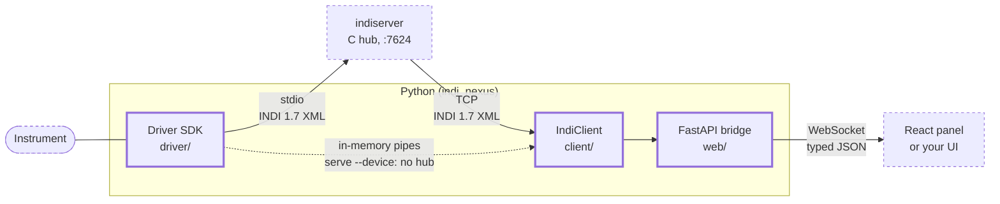

# INDINexus

Control astronomical instruments from Python, and put a web UI in front of them.

Telescopes, domes, cameras, focusers and weather stations at an observatory all speak a
common language called [INDI](https://docs.indilib.org/protocol/). A small program called
a *driver* sits between each instrument and everything else, translating. INDINexus is a
toolkit for writing those drivers in modern Python, and for building the screens
operators work from.

It has three parts:

1. A driver SDK. Describe what your instrument exposes, say how to read it and how to
   command it, and the standard INDI machinery is handled for you.
2. A Python client. Connect to an observatory, watch instruments change, send commands.
3. A web UI: a ready-made control panel, plus React components for building your own.

Everything is fully typed, and drivers can be tested with no hardware attached.

Documentation: <https://indi-nexus.sidereal.software/> has the guides, a live in-browser
demo, and the full API reference. [DEVELOPMENT.md](DEVELOPMENT.md) covers working on
INDINexus itself.

## How the pieces fit

INDINexus does not replace the standard `indiserver` program that observatories already
run - it plugs into it. Your driver is a normal INDI driver, so existing INDI software
(KStars/Ekos, PHD2, other drivers) works with it unchanged.



Reading left to right: your driver talks to the instrument and speaks INDI to
`indiserver`, the hub every INDI system is built around. The client connects to that hub
and mirrors everything it sees into a typed cache. The bridge puts that cache behind a
WebSocket so a browser can show it.

You do not need all three; writing only a driver is normal.

## Try it

Python 3.12 or newer is the only requirement. The web panel is compiled into the package,
so none of this needs a Node toolchain or an `indiserver` install.

```bash
pip install indi-nexus

indi-nexus new my_driver.py                 # a complete, commented driver
indi-nexus serve --device my_driver:MyDriver   # run it, with the panel
```

Open <http://localhost:8000/> for a working control panel driven by the driver you just
made. Press Connect and its telemetry starts counting; flip the power switch and a line
appears in the message log.

`--device` runs the driver inside the web process so that trying it out needs one install
instead of two. Real observatories run their drivers under `indiserver`, and so should
you: `indiserver ./my_driver.py`, then `indi-nexus serve` with no `--device`. The driver
file is the same either way.

To look before installing, the [live demo](https://indi-nexus.sidereal.software/demo-app/index.html)
runs the real panel against a simulated dome inside your browser.

## Writing a driver

A driver is one Python class. Declare what the instrument exposes in `setup()`, read it on
a timer with `@every`, and react to the operator with `@on_new`:

```python
from indi_nexus.driver import Device, every, on_new
from indi_nexus.protocol import IPState, Number, NumberVector

class Mount(Device):
    name = "Mount"

    async def setup(self) -> None:
        # What this device exposes. Clients draw their UI from this.
        self.define_connection()                       # the standard Connect button
        self.define_number(
            "EQUATORIAL_EOD_COORD",                    # standard INDI name for "where it points"
            [Number(name="RA", format="%9.6m"), Number(name="DEC", format="%9.6m")],
        )

    async def on_connect(self) -> None:
        # Called when the operator presses Connect. Open the hardware link here.
        await self.open_serial_link()

    @every(seconds=1, when_connected=True)
    async def poll(self) -> None:
        # Runs once a second, but only while connected.
        ra, dec = await self.read_mount()
        self["EQUATORIAL_EOD_COORD"].set(RA=ra, DEC=dec, state=IPState.OK)

    @on_new("EQUATORIAL_EOD_COORD")
    async def _goto(self, vector: NumberVector) -> None:
        # Called when someone asks the mount to point somewhere.
        if not self.require_connected():
            return
        await self.slew_to(vector.get("RA", 0.0), vector.get("DEC", 0.0))

if __name__ == "__main__":
    Mount.run()
```

`open_serial_link`, `read_mount` and `slew_to` are the only parts you write; they are
whatever talks to your instrument. The Connect button and its lifecycle, the timer, the
dispatch, the wire format and the error handling all come from the framework. For a
driver that runs as written, see [`examples/flat_panel.py`](examples/flat_panel.py).

Or start from a working file and open it in the panel:

```bash
indi-nexus new my_driver.py
indi-nexus serve --device my_driver:MyDriver
```

The [driver guide](https://indi-nexus.sidereal.software/guides/writing-drivers/) walks
through this line by line, and the
[porting guide](https://indi-nexus.sidereal.software/guides/porting-from-pyindi/) maps the
pyINDI API onto it.

### Testing without hardware

Drivers are ordinary Python objects, so a test can drive one directly and check what it
told its clients, without an instrument, an `indiserver` or a socket:

```python
from indi_nexus.protocol import IPState
from indi_nexus.testing import DeviceHarness
from my_driver import MyDriver                    # the file `indi-nexus new` wrote

harness = DeviceHarness(MyDriver())
await harness.setup()                             # what indiserver sends on startup
await harness.write("CONNECTION", CONNECT=True)   # what the operator clicks
await harness.tick("poll")                        # run one iteration of the @every job

assert harness.latest("TELEMETRY").state is IPState.OK
```

## Building a frontend

Install `@indi-nexus/react`, point it at a bridge and name a device. That is a working
control panel:

```tsx
import { IndiProvider, DevicePanel } from "@indi-nexus/react";
import "@indi-nexus/react/styles.css";

export const App = () => (
  <IndiProvider url="ws://localhost:8000/ws">
    <DevicePanel device="Mount" />
  </IndiProvider>
);
```

Your app is served from its own origin, and the bridge accepts its own by default, so
name yours when you start it: `indi-nexus serve --allow-origin http://localhost:5173`.
A WebSocket is exempt from the same-origin policy and from CORS, so that check is the
only thing standing between `/ws` and any page an operator happens to visit.

`DevicePanel` builds itself from whatever the device says it has, so it works for a device
INDINexus has never seen. For your own layout, the same data is available through hooks;
the [frontend guide](https://indi-nexus.sidereal.software/guides/frontend/) covers both.

## The examples

Every example in `examples/` runs and is covered by tests. Start with `flat_panel.py` for
the shape of a driver, then `weather_device.py` - the one to copy for real hardware. There
are also a dome, a telescope, a CCD, a two-device camera, a driver for a live public
weather API, and three clients (`monitor_client.py` watches, `scripted_session.py` drives,
`blob_receiver.py` collects images); the
[examples guide](https://indi-nexus.sidereal.software/guides/examples/) says which to
reach for and when.

Run any of them in the panel:

```bash
indi-nexus serve \
    --device examples.telescope_device:TelescopeSimulator \
    --device examples.dome_device:DomeSimulator
```

## Running a driver for real

```bash
# Under the standard INDI hub, which is how observatories run drivers:
indiserver ./my_driver.py

indi-nexus serve      # ...then the web panel at :8000
indi-nexus monitor    # ...or a live terminal feed
```

## License

See [LICENSE](LICENSE).
