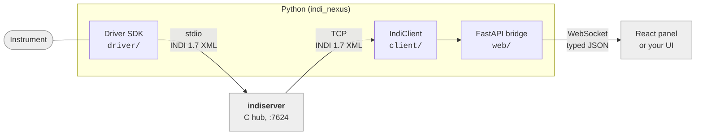

# INDINexus

**Control astronomical instruments from Python, and put a web UI in front of them.**

Telescopes, domes, cameras, focusers and weather stations at an observatory all speak a
common language called [INDI](http://www.clearskyinstitute.com/INDI/INDI.pdf). A small
program called a *driver* sits between each instrument and everything else, translating.
INDINexus is the toolkit for writing those drivers in modern Python - and for building the
screens that operators actually use.

You get three things:

1. **A driver SDK.** Describe what your instrument exposes, say how to read it and how to
   command it, and the standard INDI machinery is handled for you.
2. **A Python client.** Connect to an observatory, watch instruments change, send commands.
3. **A web UI.** A ready-made control panel, plus React components to build your own.

Everything is fully typed, and drivers can be tested without any hardware attached.

**Documentation:** <https://indi-nexus.sidereal.software/> - guides, a live in-browser
demo, and the full API reference. Working on INDINexus itself? See
[DEVELOPMENT.md](DEVELOPMENT.md).

## How the pieces fit

INDINexus does not replace the standard `indiserver` program that observatories already
run - it plugs into it. Your driver is a normal INDI driver, so existing INDI software
(KStars/Ekos, PHD2, other drivers) works with it unchanged.



Reading left to right: your **driver** talks to the instrument and speaks INDI to
`indiserver`, the hub every INDI system is built around. The **client** connects to that
hub and mirrors everything it sees into a typed cache. The **bridge** puts that cache
behind a WebSocket so a **browser** can show it.

You do not need all three. Writing only a driver is completely normal.

## Try it in two minutes

Requires [uv](https://docs.astral.sh/uv/) (Python 3.12+) and [pnpm](https://pnpm.io)
(Node 20+) for the UI.

```bash
git clone https://github.com/sidereal-software/indi-nexus && cd indi-nexus

uv venv --python 3.12                       # create the Python environment
uv pip install -e ".[dev]"                  # install INDINexus
cd web && pnpm install && pnpm -r build && cd ..   # build the web panel

python -m examples.demo_bridge              # run a simulated device + the panel
```

Open <http://localhost:8000/> and you have a working control panel driven by a simulated
device - no observatory, no `indiserver`, nothing to configure. Flip its power switch and
watch the readouts change.

## Writing a driver

A driver is one Python class. Declare what the instrument exposes in `setup()`, read it on
a timer with `@every`, and react to the operator with `@on_new`:

```python
from indi_nexus.driver import Device, every, on_new
from indi_nexus.protocol import IPState, Number, NumberVector

class Mount(Device):
    name = "Mount"

    async def setup(self) -> None:
        # What this device exposes. Clients draw their UI from this.
        self.define_connection()                       # the standard Connect button
        self.define_number(
            "EQUATORIAL_EOD_COORD",                    # standard INDI name for "where it points"
            [Number(name="RA", format="%9.6m"), Number(name="DEC", format="%9.6m")],
        )

    async def on_connect(self) -> None:
        # Called when the operator presses Connect. Open the hardware link here.
        await self.open_serial_link()

    @every(seconds=1, when_connected=True)
    async def poll(self) -> None:
        # Runs once a second, but only while connected.
        ra, dec = await self.read_mount()
        self["EQUATORIAL_EOD_COORD"].set(RA=ra, DEC=dec, state=IPState.OK)

    @on_new("EQUATORIAL_EOD_COORD")
    async def _goto(self, vector: NumberVector) -> None:
        # Called when someone asks the mount to point somewhere.
        if not self.require_connected():
            return
        await self.slew_to(vector.get("RA", 0.0), vector.get("DEC", 0.0))

if __name__ == "__main__":
    Mount.run()
```

Start from a working file and see it in the panel immediately:

```bash
indi-nexus new my_driver.py
python -m examples.demo_bridge --device my_driver:MyDriver
```

The [driver guide](https://indi-nexus.sidereal.software/guides/writing-drivers/) walks
through this line by line. Coming from pyINDI? There is a
[porting guide](https://indi-nexus.sidereal.software/guides/porting-from-pyindi/).

### Testing without hardware

Drivers are ordinary Python objects, so you can drive one in a test and check what it told
its clients - no instrument, no `indiserver`, no sockets:

```python
from indi_nexus.testing import DeviceHarness

harness = DeviceHarness(MyDriver())
await harness.setup()                       # what indiserver sends on startup
await harness.write("CONNECTION", CONNECT=True)   # what the operator clicks
await harness.tick("poll")                  # run one iteration of the @every job

assert harness.latest("WEATHER_PARAMETERS").state is IPState.OK
```

## Building a frontend

Install `@indi-nexus/react`, point it at a bridge, and name a device - that is a working
control panel:

```tsx
import { IndiProvider, DevicePanel } from "@indi-nexus/react";
import "@indi-nexus/react/styles.css";

export const App = () => (
  <IndiProvider url="ws://localhost:8000/ws">
    <DevicePanel device="Mount" />
  </IndiProvider>
);
```

`DevicePanel` builds itself from whatever the device says it has, so it works for a device
INDINexus has never seen. When you want your own layout instead, the same data is
available through hooks - see the
[frontend guide](https://indi-nexus.sidereal.software/guides/frontend/).

## The examples

Every example in `examples/` runs. Read them in this order:

| Example | What it shows |
|---|---|
| `demo_device.py` | The smallest complete driver: one of each property kind, a switch that starts and stops an animation. |
| `weather_device.py` | **The one to copy for real hardware.** A blocking instrument library, a link that can drop, and a full test suite. |
| `dome_device.py` | A realistic instrument: connect, rotate, open a shutter, park, abort. |
| `telescope_device.py` | Pointing and tracking: goto, sync, slew rates, guide pulses. |
| `ccd_device.py` | Images: exposures that deliver a FITS frame, plus a cooler. |
| `monitor_client.py` | The other side - connect to an observatory and print everything that happens. |
| `demo_bridge.py` | Driver + bridge + web panel in one process, for development. |

Run any of them in the panel:

```bash
python -m examples.demo_bridge \
    --device examples.telescope_device:TelescopeSimulator \
    --device examples.dome_device:DomeSimulator
```

## Running a driver for real

```bash
# Under the standard INDI hub, which is how observatories run drivers:
indiserver ./my_driver.py

indi-nexus serve      # ...then the web panel at :8000
indi-nexus monitor    # ...or a live terminal feed
```

## License

See [LICENSE](LICENSE).
