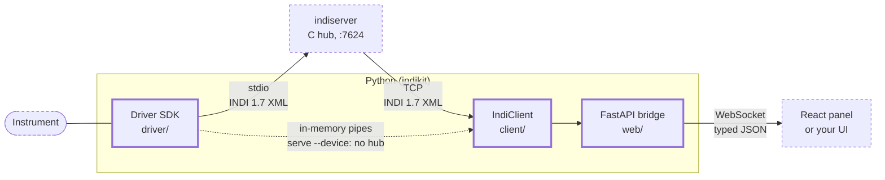

# INDIkit

Control astronomical instruments from Python, and build the screens operators work from.

Telescopes, domes, cameras, focusers and weather stations at an observatory all speak a
common language called [INDI](guides/protocol.md). A *driver* sits between each instrument
and everything else, translating. INDIkit is for writing those drivers in modern Python -
and for building the interfaces an operator drives them from.

Both halves are first-class. Take one, or both.

<div class="grid" markdown>

<div markdown>

### Write the driver

```python
POS = "FOCUS_ABSOLUTE_POSITION"


class Focuser(Device):
    name = "Focuser"

    async def setup(self) -> None:
        self.define_connection()
        self.define_number(
            "ABS_FOCUS_POSITION",
            [Number(
                name=POS,
                min=0,
                max=50000,
                value=25000,
            )],
        )

    @on_new("ABS_FOCUS_POSITION")
    async def goto(
        self, v: NumberVector
    ) -> None:
        self["ABS_FOCUS_POSITION"].set(
            {POS: v.get(POS, 0.0)},
            state=IPState.OK,
        )
```

Properties, ranges and labels are declared once. The read loop, the XML, the dispatch and
the connection lifecycle are already written.

</div>

<div markdown>

### Build the UI

```tsx
function Focus() {
  const at = useNumber(
    "Focuser",
    "ABS_FOCUS_POSITION",
    "FOCUS_ABSOLUTE_POSITION",
  );
  const client = useIndiClient();

  const nudge = () => {
    const to = (at ?? 0) + 500;
    client.setNumber(
      "Focuser",
      "ABS_FOCUS_POSITION",
      { FOCUS_ABSOLUTE_POSITION: to },
    );
  };

  return (
    <>
      <output>{at ?? "-"}</output>
      <button onClick={nudge}>
        Out
      </button>
    </>
  );
}
```

Ten typed hooks read the live instrument. Every one re-renders only the components that
asked for the value that changed.

</div>

</div>

## Or write no UI at all

Every INDI device says what it has: properties, kinds, ranges, labels. So the panel can be
generated from the device rather than written per instrument.

```tsx
import { IndiProvider, DevicePanel } from "@indikit/react";
import "@indikit/react/styles.css";

export function App() {
  return (
    <IndiProvider url="ws://localhost:8000/ws">
      <DevicePanel device="Focuser" />
    </IndiProvider>
  );
}
```

Numbers get their units and limits. Switches become radio buttons or checkboxes according
to the INDI rule. Lights become a coloured dot with its state written beside it, BLOBs
become download links, and read-only properties are not editable.

That panel also ships compiled into the Python wheel, so `indikit serve` puts one in front
of your driver with no frontend build at all.

## Install and run

```bash
pip install indikit
indikit new my_driver.py
indikit serve --device my_driver:MyDriver
```

Open <http://localhost:8000/>. The driver `new` just wrote is in the sidebar with a
control panel in front of it. Press Connect and its telemetry starts counting.

Python 3.12 or newer is the only requirement. The panel is compiled into the wheel, so
there is no Node build. `--device` runs the driver in-process, so there is no `indiserver`
to install first.

[Getting started, a step at a time](getting-started.md){ .md-button .md-button--primary }

## See it running

One page runs two simulated drivers - a dome and a weather station - through a single
client, speaking the same JSON the FastAPI bridge speaks. The simulation runs in the page
itself: nothing to download, no server, no account.

Press Connect and the dome moves. Open the shutter, send it to an azimuth, park it, hit
Abort mid-slew. The weather readings are fetched live from Open-Meteo, falling back to a
recorded reply when the API cannot be reached. The message log narrates what both drivers
are saying, the way it would at a real site.

The same two devices are shown two ways, switchable: the panel that generates itself from
whatever the drivers declare, and a hand-built observatory wallboard. The wallboard is
built from the hooks below, so it is also the worked answer to "what if I want my own
screen". The [tutorial](guides/tutorial-open-meteo.md) writes both it and the weather
driver.

[Open the live demo](demo-app/index.html){ .md-button }

## The hooks

`@indikit/react` is a real library, not a wrapper around the panel. Ten hooks read the
live instrument, each one subscribing narrowly enough that a changing number re-renders
the component showing that number and nothing else.

| Hook | Returns |
|---|---|
| `useConnection()` | whether the bridge is up, and what it is connected to |
| `useDevices()` | the device names the hub currently knows |
| `useDevice(device)` | one device's whole property set |
| `useProperty(device, name)` | a whole vector, with its state and metadata |
| `useElement(device, name, element)` | one element, with its type intact |
| `useNumber(device, name, element)` | a number's value |
| `useText(device, name, element)` | a text element's value |
| `useSwitch(device, name, element)` | a switch's value, as a boolean |
| `useLight(device, name, element)` | a light's `IPState` |
| `useMessages(limit)` | what the devices have been saying |

The read hooks are read-only on purpose. Writes go through `useIndiClient()` and its
`setNumber` / `setText` / `setSwitch` / `setBlob`, so the thing that mutates an instrument
is always visible at the call site rather than hidden in a setter.

Components come with it too - `DevicePanel`, `PropertyVectorCard`, the element controls,
the message log - built on shadcn/ui, and styled by your own Tailwind theme.

[Building a frontend](guides/frontend.md){ .md-button }

## Testing without hardware

A driver is an ordinary Python object, so a test can drive it and read back what it told
its clients:

```python
from indikit.protocol import IPState
from indikit.testing import DeviceHarness

from focuser_device import Focuser


async def test_focuser_travels_to_its_target():
    harness = DeviceHarness(Focuser())
    await harness.setup()  # what indiserver sends at startup
    await harness.write("CONNECTION", CONNECT=True)  # the operator presses Connect

    await harness.write("ABS_FOCUS_POSITION", FOCUS_ABSOLUTE_POSITION=26000)

    # Busy while it travels, so a client never draws the move as finished early.
    assert harness.latest("ABS_FOCUS_POSITION").state is IPState.BUSY
    for _ in range(4):
        await harness.tick("_step")  # one turn of the @every job, no waiting
    assert harness.latest("ABS_FOCUS_POSITION").state is IPState.OK
```

Nothing in that test opens a socket, starts a subprocess, parses XML or touches an
instrument.

`write()` builds the partial vector a real client sends and routes it through the device's
real dispatch: the `@on_new` map, the device-name guard, the serialisation lock. A handler
that passes here works under `indiserver`. `tick(job)` runs one iteration of an `@every`
job without waiting out its interval, which is how a move that takes seconds is tested in
microseconds.

Every example in the repository is covered this way, the focuser above included. The
driver guide's [testing section](guides/writing-drivers.md#testing-without-hardware) is
the full account.

!!! note "Running that test"

    That test is written for `pytest` with
    [pytest-asyncio](https://pytest-asyncio.readthedocs.io/) in `asyncio_mode = "auto"`.
    Without that, wrap the body in `asyncio.run`.

## What the driver SDK replaces

INDIkit already contains the parts every driver would otherwise write again:

- the read loop over stdin;
- the XML parser that has to survive a start tag split across two reads;
- the dispatch chain on property name;
- the timer whose period drifts by the length of each tick;
- the poll that publishes stale state over a command that arrived while it was running.

The last two are handled explicitly. `@every` runs against a rolling deadline, so a job's
period does not drift by the tick's own duration.
[Ticks and client writes never overlap](guides/writing-drivers.md#serialised-dispatch), so
a slow poll cannot publish pre-write state over a button the operator just pressed.

## How the pieces fit

INDIkit plugs into `indiserver`, the hub program observatories already run. It does not
replace it. Your driver is an ordinary INDI driver, so existing INDI software (KStars/Ekos,
PHD2, other drivers) works with it unchanged.



- Your driver talks to the instrument and speaks INDI to `indiserver`.
- The client connects to that hub and mirrors everything into a typed cache you can read
  and watch from Python.
- The bridge puts that cache behind a WebSocket so a browser can show it.

You do not need all three. Writing only a driver is the common case, and so is building a
screen against an observatory somebody else runs.

## What this does not do

- **It does not reimplement `indiserver`.** The C hub stays the hub and your driver runs
  as its child, which is what keeps the rest of the INDI ecosystem working against it.
  Only the Python and browser layers are new here.
- **`--device` is not a hub.** It runs drivers inside the web process: one client, and it
  stops when you stop the command. It exists so that trying this out needs one install
  instead of two, so run anything real under `indiserver`. Access control is the same
  either way: `--token` and `--allow-origin` apply with `--device` as without it, and a
  non-loopback `--host` with no token is refused in both.
- **It does not talk to your instrument for you.** There is no vendor library in here. You
  write the link to the hardware. `await self.off_thread(...)` keeps a blocking vendor
  call from stalling the event loop, and that is the extent of the help.

## Pick a starting point

<div class="grid cards" markdown>

-   **Writing a driver**

    Defining properties, polling with `@every`, handling client writes with `@on_new`,
    the connection lifecycle, and testing the result. Builds the focuser above.

    [Write a driver](guides/writing-drivers.md)

-   **Building a frontend**

    The provider, the ten hooks, writing back through the client, and the generated
    panel when you would rather not draw one. Builds the observatory wallboard from the
    demo.

    [Build a frontend](guides/frontend.md)

-   **Coming from pyINDI**

    A row-by-row mapping from `ISGetProperties`, the four `ISNew*` methods, `IUFind`,
    `IDSet` and `@device.repeat` to their equivalents here. Property names, element
    names, labels and groups all stay as they are, so your existing clients see the same
    device before and after the port.

    [Port a pyINDI driver](guides/porting-from-pyindi.md)

-   **Drivers that talk to real hardware**

    A blocking vendor-style client behind `off_thread`, hardware that stops answering,
    and `emit="on_change"` readbacks. `weather_device.py` is the one to copy.

    [Read the examples](guides/examples.md)

-   **The API**

    Every public signature, generated from the source.

    [Driver SDK](reference/python/driver.md) ·
    [Testing](reference/python/testing.md) ·
    [Client](reference/python/client.md) ·
    [`@indikit/react`](reference/typescript/react/index.md)

</div>
