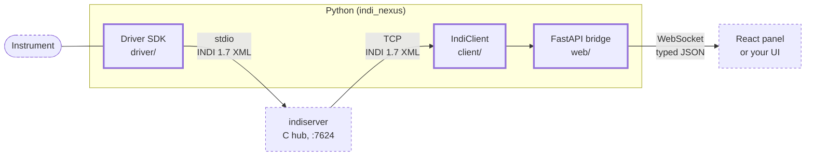

# INDINexus

**If you have written an instrument driver before, this is the version where the
plumbing is already done.** A driver is one Python class, it runs under the
`indiserver` you already have, you can test all of it with nothing plugged in, and a
browser control panel comes with it. (New to [INDI](guides/protocol.md)? That page is
the vocabulary.)

Rather see it running first? [Drive a simulated dome in your browser](demo-app/index.html)
- the real panel, nothing installed. [Two more below](#three-demos-nothing-installed).

Here is a complete driver for a flat-field lamp - a switch and a brightness dial:

```python title="examples/flat_panel.py, docstrings trimmed"
from indi_nexus.driver import Device, on_new
from indi_nexus.protocol import (
    IPState,
    ISRule,
    ISState,
    Number,
    NumberVector,
    Switch,
    SwitchVector,
)

MIN_BRIGHTNESS = 0
MAX_BRIGHTNESS = 255


class FlatPanel(Device):
    """A flat-field lamp: on/off, and a brightness dial."""

    name = "Flat Panel"

    async def setup(self) -> None:
        """Define the lamp switch and the brightness dial."""
        self.define_switch(
            "LIGHT_CONTROL",
            [
                Switch(name="ON", label="On"),
                Switch(name="OFF", label="Off", value=ISState.ON),
            ],
            # Exactly one of these is on, so a client draws radio
            # buttons, and turning one on turns the other off
            # without the driver saying so.
            rule=ISRule.ONE_OF_MANY,
            label="Lamp",
            group="Main Control",
        )
        self.define_number(
            "LIGHT_BRIGHTNESS",
            [
                Number(
                    name="BRIGHTNESS",
                    label="Brightness",
                    format="%.0f",
                    min=MIN_BRIGHTNESS,
                    max=MAX_BRIGHTNESS,
                    value=128,
                )
            ],
            label="Brightness",
            group="Main Control",
        )
        self.message("Flat panel ready.")

    @on_new("LIGHT_CONTROL")
    async def _switch_lamp(self, vector: SwitchVector) -> None:
        """Turn the lamp on or off in response to a client write."""
        on = vector.selected() == "ON"
        self["LIGHT_CONTROL"].set(
            {"ON" if on else "OFF": ISState.ON},
            state=IPState.OK,
        )
        self.message(f"Lamp turned {'on' if on else 'off'}.")

    @on_new("LIGHT_BRIGHTNESS")
    async def _set_brightness(self, vector: NumberVector) -> None:
        """Clamp a requested brightness to the advertised range."""
        wanted = vector.get("BRIGHTNESS", 0.0)
        # A client is free to ask for anything; the advertised
        # min/max is a promise about the hardware, so hold to it
        # rather than passing the value through.
        clamped = max(MIN_BRIGHTNESS, min(MAX_BRIGHTNESS, wanted))
        self["LIGHT_BRIGHTNESS"].set(BRIGHTNESS=clamped, state=IPState.OK)


if __name__ == "__main__":
    FlatPanel.run()
```

That is
[`examples/flat_panel.py`](https://github.com/sidereal-software/indi-nexus/blob/main/examples/flat_panel.py),
shown without its module docstring and parameter docs; the file in the repository is 90
non-blank lines. It is covered by the test suite, it is the driver the
[driver guide](guides/writing-drivers.md) builds one property at a time, and you can
[drive it in your browser](flat-demo/flat.html) without installing anything.

## The alternative is the driver you would write yourself

Not another framework. The thing this replaces is the driver you would hand-roll again:
the read loop over stdin, the XML parser that has to survive a start tag split across
two reads, the dispatch chain on property name, the timer whose period drifts by the
length of each tick, and the poll that lands on top of a command that arrived while it
was out.

Those last two are the ones that cost a night. `@every` runs against a rolling deadline,
so a job's period does not drift by the tick's own duration, and
[ticks and client writes never overlap](guides/writing-drivers.md#timers-and-clicks-never-overlap),
so a slow poll cannot publish pre-write state over a button the operator just pressed.

## Three commands to a working panel

```bash
pip install indi-nexus
indi-nexus new my_driver.py
indi-nexus serve --device my_driver:MyDriver
```

Open <http://localhost:8000/>. The driver `new` just wrote is in the sidebar with a
control panel in front of it: press Connect and its telemetry starts counting.

Python 3.12 or newer is the only requirement. The panel is compiled into the wheel, so
there is no Node build, and `--device` runs the driver in-process, so there is no
`indiserver` to install first.

[Getting started, a step at a time](getting-started.md){ .md-button .md-button--primary }

## Three demos, nothing installed

Each one runs the real panel against a driver simulated inside your browser, speaking
the same JSON the FastAPI bridge speaks. No server, no account, no download.

<div class="grid cards" markdown>

-   **A dome you can move**

    Press Connect, open the shutter, send it to an azimuth, park it, hit Abort
    mid-slew. The message log narrates what the driver is saying, the way it would at
    a real site.

    [Open the dome demo](demo-app/index.html){ .md-button }

-   **The driver at the top of this page**

    The same flat panel: same property names, same exclusive switch rule, same clamped
    brightness range. The behaviour above, in your tab.

    [Open the lamp demo](flat-demo/flat.html){ .md-button }

-   **Live data, one device, two UIs**

    Real readings fetched from Open-Meteo, shown twice from a single client: the panel
    that generates itself, and a hand-built operator screen. The
    [tutorial](guides/tutorial-open-meteo.md) writes both.

    [Open the weather demo](weather-demo/weather.html){ .md-button }

</div>

## Test the whole driver with no hardware

A driver is an ordinary Python object, so a test can drive it and read back what it told
its clients:

```python
from indi_nexus.protocol import ISState
from indi_nexus.testing import DeviceHarness

from flat_panel import FlatPanel


async def test_lamp_turns_on():
    harness = DeviceHarness(FlatPanel())
    await harness.setup()  # what indiserver sends at startup

    await harness.write("LIGHT_CONTROL", ON=True)  # the operator clicks On

    assert harness.latest("LIGHT_CONTROL").get("ON") is ISState.ON
    assert "turned on" in harness.messages[-1]
```

No sockets, no subprocess, no XML, no instrument. `write()` builds the partial vector a
real client sends and routes it through the device's real dispatch - the `@on_new` map,
the device-name guard, the serialisation lock - so a handler that passes here works
under `indiserver`. `tick(job)` runs one iteration of an `@every` job without waiting
out its interval.

Every example in the repository is covered this way, the flat panel above included.
[Testing without hardware](guides/writing-drivers.md#testing-without-hardware) is the
full account.

!!! note "Running that test"

    It is written for `pytest` with [pytest-asyncio](https://pytest-asyncio.readthedocs.io/)
    in `asyncio_mode = "auto"`. Without that, wrap the body in `asyncio.run`.

## A control panel you did not have to write

Every INDI device says what it has - properties, kinds, ranges, labels - so the UI can
be generated from the device rather than written per instrument:

```tsx
import { IndiProvider, DevicePanel } from "@indi-nexus/react";
import "@indi-nexus/react/styles.css";

export function App() {
  return (
    <IndiProvider url="ws://localhost:8000/ws">
      <DevicePanel device="Flat Panel" />
    </IndiProvider>
  );
}
```

Numbers get their units and limits, switches become radio buttons or checkboxes
according to the INDI rule, lights become coloured dots, BLOBs become download links,
and read-only properties are not editable. When you want a purpose-built screen instead,
the same data is on hooks - [building a frontend](guides/frontend.md) covers both.

## How the pieces fit

INDINexus does not replace `indiserver`, the hub program observatories already run - it
plugs into it. Your driver is an ordinary INDI driver, so existing INDI software
(KStars/Ekos, PHD2, other drivers) works with it unchanged.



- Your **driver** talks to the instrument and speaks INDI to `indiserver`.
- The **client** connects to that hub and mirrors everything into a typed cache you can
  read and watch from Python.
- The **bridge** puts that cache behind a WebSocket so a browser can show it.

You do not need all three. Writing only a driver is what most people come here for.

## What this does not do

- **It does not reimplement `indiserver`.** The C hub stays the hub and your driver runs
  as its child, which is what keeps the rest of the INDI ecosystem working against it.
  Only the Python and browser layers are new here.
- **`--device` is not a hub.** It runs drivers inside the web process: one client, no
  access control, and it stops when you stop the command. It exists so that trying this
  out needs one install instead of two. Run anything real under `indiserver`.
- **It does not talk to your instrument for you.** There is no vendor library in here.
  You write the link to the hardware; `await self.off_thread(...)` keeps a blocking
  vendor call from stalling the event loop, and that is the extent of the help.

## Pick a starting point

<div class="grid cards" markdown>

-   **From a blank file to a driver**

    Defining properties, polling with `@every`, handling client writes with `@on_new`,
    the connection lifecycle, and testing the result. Builds the flat panel above.

    [Write a driver](guides/writing-drivers.md)

-   **Coming from pyINDI**

    A row-by-row mapping from `ISGetProperties`, the four `ISNew*` methods, `IUFind`,
    `IDSet` and `@device.repeat` to their equivalents here. Property names, element
    names, labels and groups all stay as they are, so your existing clients see the same
    device before and after the port.

    [Port a pyINDI driver](guides/porting-from-pyindi.md)

-   **A driver that talks to something real**

    A blocking vendor-style client behind `off_thread`, hardware that stops answering,
    and `emit="on_change"` readbacks. `weather_device.py` is the one to copy.

    [Read the examples](guides/examples.md)

-   **The API**

    Every public signature, generated from the source.

    [Driver SDK](reference/python/driver.md) ·
    [Testing](reference/python/testing.md) ·
    [Client](reference/python/client.md) ·
    [Protocol](reference/python/protocol.md)

</div>
