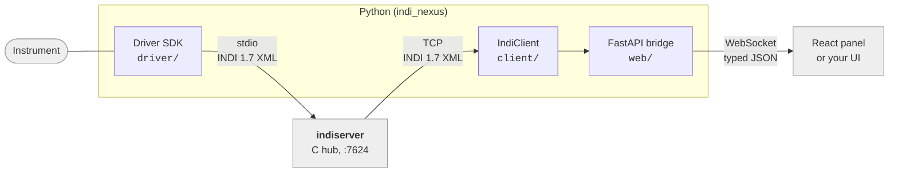

# INDINexus

**Control astronomical instruments from Python, and put a web UI in front of them.**

Telescopes, domes, cameras, focusers and weather stations at an observatory all speak a
common language called [INDI](http://www.clearskyinstitute.com/INDI/INDI.pdf). A small
program called a *driver* sits between each instrument and everything else, translating.
INDINexus is the toolkit for writing those drivers in modern Python - and for building the
screens operators actually use.

<div class="grid cards" markdown>

- **Write a driver**

    Describe what your instrument exposes, say how to read it and how to command it. The
    standard INDI machinery - connection, dispatch, timers, error handling - is handled
    for you, and you can test the whole driver with no hardware attached.

    [Write your first driver](guides/writing-drivers.md)

- **Build a UI**

    Point `IndiProvider` at an observatory, name a device, and you have a working control
    panel that builds itself from whatever that device exposes. Or use the same data
    through hooks and lay it out yourself.

    [Build a frontend](guides/frontend.md)

</div>

## See it working

The real INDINexus panel, driving a **simulated dome entirely inside your browser** - no
server, nothing installed. Press Connect, open the shutter, send it to an azimuth, park
it, and watch the message log narrate what the driver is saying.

[Launch the live demo](demo-app/index.html){ .md-button .md-button--primary }

## How the pieces fit

INDINexus does not replace `indiserver`, the hub program observatories already run - it
plugs into it. Your driver is an ordinary INDI driver, so existing INDI software
(KStars/Ekos, PHD2, other drivers) works with it unchanged.



Reading left to right:

- Your **driver** talks to the instrument and speaks INDI to `indiserver`.
- The **client** connects to that hub and mirrors everything into a typed cache you can
  read and watch from Python.
- The **bridge** puts that cache behind a WebSocket so a browser can show it.

You do not need all three. Writing only a driver is completely normal - that is what most
people come here for.

## A taste

A driver is one class. This one reports where a mount is pointing, once a second, and
slews when asked:

```python
from indi_nexus.driver import Device, every, on_new
from indi_nexus.protocol import IPState, Number, NumberVector

class Mount(Device):
    name = "Mount"

    async def setup(self) -> None:
        self.define_connection()
        self.define_number(
            "EQUATORIAL_EOD_COORD",
            [Number(name="RA", format="%9.6m"), Number(name="DEC", format="%9.6m")],
        )

    @every(seconds=1, when_connected=True)
    async def poll(self) -> None:
        ra, dec = await self.read_mount()
        self["EQUATORIAL_EOD_COORD"].set(RA=ra, DEC=dec, state=IPState.OK)

    @on_new("EQUATORIAL_EOD_COORD")
    async def _goto(self, vector: NumberVector) -> None:
        await self.slew_to(vector.get("RA", 0.0), vector.get("DEC", 0.0))
```

And a control panel for it is three lines of React:

```tsx
import { IndiProvider, DevicePanel } from "@indi-nexus/react";
import "@indi-nexus/react/styles.css";

export const App = () => (
  <IndiProvider url="ws://localhost:8000/ws">
    <DevicePanel device="Mount" />
  </IndiProvider>
);
```

[Get started](getting-started.md){ .md-button .md-button--primary }
[Browse the API](reference/python/driver.md){ .md-button }
