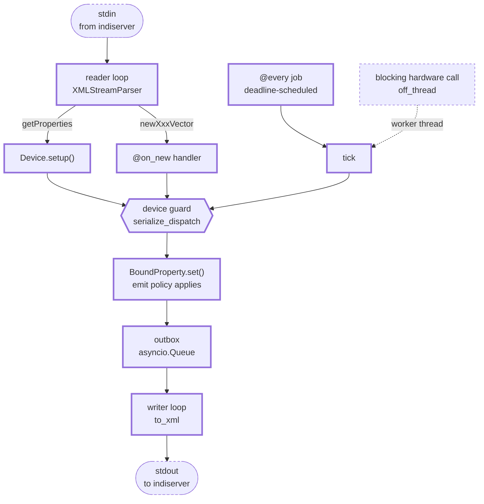

# The Python package

Detail for `src/indi_nexus/`. The repository-wide rules are in the root `CLAUDE.md`.

## Inside a running driver

What the runtime owns, and where the device guard sits. **Keep this current** - it is one of
the two diagrams named in the root file's diagram table.

## `exceptions.py` - the error hierarchy

Everything the package raises on purpose derives from **`IndiError`**, so an application
can survive the library with one `except`. Every type **also derives from the builtin that
used to be raised at its site**, which is the whole reason the hierarchy could land without
breaking anything: existing `except KeyError` / `except RuntimeError` / `except ValueError`
in this repository, in the examples and in third-party drivers keeps catching exactly what
it caught before. The builtin comes first in the MRO after `IndiError`, so message
formatting (`KeyError`'s repr-quoting) is unchanged too.

| Type | Also a | Raised when |
|---|---|---|
| `ProtocolError` | `ValueError` | the wire format is violated: junk where a number belongs, a missing `#REQUIRED` attribute, an unknown element kind, a non-finite value neither codec can carry |
| `PropertyNotFound` | `KeyError` | a property or an element is looked up by a name nothing answers to |
| `WrongPropertyKind` | `TypeError` | a property is reached through an accessor for another vector kind, or `select()` has no natural unselected value |
| `PropertyRetracted` | `RuntimeError` | a retracted `BoundProperty` handle is used to publish |
| `DeviceNotServing` | `RuntimeError` | a `Device` sends while not attached to a runtime |
| `NotConnectedError` | `ConnectionError` | `IndiClient` has no live connection, on a send or to fail a parked `wait_for` |
| `SendQueueFull` | `RuntimeError` | the client's outbox is full because the connection stopped draining it |

Adding a type here means answering both questions: what it is a kind of (`IndiError`,
always) and which builtin it has to stay compatible with. `tests/test_exceptions.py` asserts
both halves per type, and that is the test that stops the compatibility guarantee rotting.

## `protocol/` - the wire format

The single source of truth for INDI 1.7: typed models, exact wire-token enums, and a real
streaming parser (no runtime DTD reflection, no "accumulate stdin and retry
`etree.fromstring`" framing loop).

- `enums.py` - `IPState`, `IPerm`, `ISRule`, `ISState`, `BLOBPolicy`, each an `enum.StrEnum`
  so a member **is** its wire token (`IPState.OK == "Ok"`) and Pydantic serializes it
  directly. `coerce_switch(value)` lives here as well: every API that takes a switch value
  from application code - `BoundProperty.set`, `IndiClient.set_switch`,
  `DeviceHarness.write` - accepts `ISState`, `bool` and the wire token, and this is the one
  implementation of that. It used to be three private copies, one of which `testing.py`
  reached across subpackages to import.
- `models.py` - the Pydantic models.
  - A **vector** (`NumberVector`, `TextVector`, `SwitchVector`, `LightVector`, `BLOBVector`)
    is the canonical in-memory property, discriminated on `kind`.
  - `def` / `set` / `new` are a wire **intent**, not different data, so they are thin
    wrappers (`DefVector`, `SetVector`, `NewVector`) around a vector rather than five
    duplicated classes each. Facts about the *message* rather than the property live on
    the wrapper: `SetVector.state_present` records whether the wire carried a `state`,
    which is `#IMPLIED` on a `set*Vector` and means "no change if absent". Keeping it
    there is what lets `Vector.state` stay non-nullable for every reader of a cached
    property.
  - Every timestamp is UTC. `IndiTimestamp` (an `AfterValidator` around `as_utc`) is the
    one normalisation point: a naive datetime is **read as** UTC, because that is what a
    bare INDI timestamp means, and an aware one is converted. `indi_now()` is the driver
    default - aware UTC truncated to the second, since the XML format has no more
    resolution than that. Assigning straight to a model attribute skips the validator, so
    code that does (`BoundProperty.set`) calls `as_utc` itself.
  - Element metadata (number `format`/`min`/`max`/`step`, switch `rule`) is optional with
    defaults, because `set`/`one` messages carry only `name` + value. Clients merge `set`
    values onto the previous definition, which is standard INDI behavior.
  - `LightVector` has no `perm`; lights are always read-only in INDI.
  - Handler ergonomics live on the vector: `element(name)`/`[name]` (raising
    `PropertyNotFound`), `get(name, default)` (tolerant; BLOBs yield `data`), `values()`,
    and `SwitchVector.selected()`.
  - `detached()` is the one implementation of "a vector handed to someone else is a value":
    a shallow copy plus copied elements, which is all that is needed because every other
    field is an immutable scalar rebound on assignment. Both owners of a live, mutating
    vector use it - the driver's `BoundProperty` for every message it emits, the client for
    every vector `wait_for` resolves with - so the rule cannot drift between them.
  - Non-property messages: `GetProperties`, `DelProperty`, `Message`, `EnableBLOB`. A client
    must send `enableBLOB` before `indiserver` forwards any BLOB.
- `numbers.py` - `format_number` / `parse_number`, the INDI printf `format` including the
  `%m` sexagesimal form, which is what makes RA/Dec interop work. **Not an XML concern**,
  which is why they are not in `xml.py`: the same rendering is what a browser sees through
  the JSON codec, and the driver's `emit="on_change"` policy compares numbers in exactly
  this representation, because "changed" means changed as far as a client can tell. Both
  are exported from `indi_nexus.protocol`, as the TypeScript mirror exports `formatNumber`.
  - `format_number` matches `fs_sexa` including its rounding: half-way values go **away
    from zero**, not to even. This was a **Python-only** divergence - the TypeScript
    mirror in `web/packages/client/src/format.ts` was correct all along - so fix them
    apart, not together. `parse_number` is a deliberate **superset** of `f_scansexa`: it
    reads sexagesimal on the `set` path too, where libindi uses `std::stod` and would read
    `10:30:00` as `10.0`. Keep it; matching libindi there is a data-corruption bug.
- `xml.py` - `to_xml(msg)` serializes; `parse_indi(data)` parses a complete chunk;
  `XMLStreamParser` is the incremental parser for a stream (synthetic root, emits depth-1
  elements as they complete, clears consumed nodes so memory stays flat). Number text goes
  through `numbers.py` in both directions.
  - **Nothing a peer sends makes the parser raise.** A raise here escapes the driver
    runtime's per-message isolation (it happens while *iterating* `feed()`) and kills the
    client's reconnect loop, so malformed input is absorbed and counted instead:
    `dropped` for an element whose values would not parse, `resets` for a reopening of the
    document after an unmatched close tag. `resets` is a framing signal, not a loss count.
    Both counters describe **the peer on this stream**, not one lxml object: `resync()`
    rebuilds the parser underneath them and leaves them running. The rule the leniency
    follows: **a leaf may degrade to a representable absence, it may never invent a
    value** - `min=''` becomes `None`, a junk `oneNumber` costs the whole element, because
    `value` is not nullable. A missing `#REQUIRED` `device`/`name` costs the whole
    message for the same reason (`_required`): `""` is not a degraded device, it is an
    invented one, and it used to land in the client's cache as a phantom device nothing
    would ever update. BLOB payloads are decoded **strictly** - whitespace stripped first,
    because real traffic carries the base64 across lines, and validated after, because a
    decoder that silently discards non-alphabet characters turns a corrupt frame into a
    plausible one.
  - **Non-finite numbers are refused, in both codecs.** JSON has no literal for NaN or
    the infinities, so `to_json` wrote `null` and `from_json` then rejected its own
    output. `Number.value` forbids them (`allow_inf_nan=False`), `parse_number` raises on
    them so the XML side drops the element, and `_optfloat` degrades a non-finite
    `min`/`max`/`step` to `None` because that field *can* say absent.
  - `stalled` is the backstop for the failure the parser cannot see: lxml can be left
    emitting nothing at all (a root close arriving mid-start-tag), with no event and an
    empty `error_log`. The reader loops watch `bytes_since_last_message` against
    `STALL_THRESHOLD_BYTES` and reconnect (client) or call `resync()` (driver), logging
    the stream's `dropped`/`resets` history as they go. Reopening the document is
    recovery, not progress, so it leaves the counter running: a peer sending nothing but
    close tags trips the stall too, rather than holding the budget at zero forever.
- `json.py` - the browser codec. `to_json` / `from_json` mirror `to_xml` / `parse_indi` over
  a `TypeAdapter(IndiMessage)`. `IndiMessage` carries **`Field(discriminator="tag")`**, as
  `Element` and `Vector` carry `discriminator="kind"`, and that is what makes the union
  **closed**: a frame whose `tag` is missing or unknown is refused, and an invalid frame
  reports one error against the member it named instead of seven parallel ones. It has to
  be declared, not inferred - `GetProperties` defaults every field and `_Model` is
  `extra="ignore"`, so undiscriminated the union matched `{}`, and every other
  unrecognised object, as a `getProperties`. That was a live hole: `Bridge.handle_incoming`
  accepted a browser echoing a bridge **control** frame back up `/ws` and forwarded it
  upstream. Same models, so the JSON *is* the frontend contract; BLOB bytes travel as
  base64.

## `driver/` - the SDK

What a driver author subclasses. The vocabulary is plain Python: no libindi-C surface
(`IUFind`/`IDSet*`/`IEAddTimer`), no per-tag `ISNew*` dispatch, no class-global registries.

- `device.py` - `Device`. Override `async def setup()` and declare properties with
  `define_number/text/switch/light/blob(...)`, each returning a `BoundProperty` typed by the
  vector kind and emitting the `def`. Reach them later via `self["NAME"]` (untyped, since a
  name lookup cannot know the kind) or the typed getters `self.number/text/switch/light/blob`
  when you need `.vector.elements` narrowed. `self.message()` / `self.log_error()` send INDI
  `message`s; `Device.run()` serves over stdio.
  - A `setup()` that **raises** is a retry, not a death sentence: the `@every` gate opens
    anyway (a driver whose jobs never run is dead while still looking alive to
    `indiserver`, and a job is the only thing left that can notice hardware appearing),
    and the attempt is not latched, so a later `getProperties` runs `setup()` again. The
    failed attempt is **rolled back** the way a raising `on_connect` is: everything it
    defined before raising is retracted with a `delProperty` and dropped, so a partial
    probe never leaves a channel announced that the retry does not define again. The
    handles it returned die with it - `set()` on one raises - so reach properties through
    `self["NAME"]` rather than caching a handle across a failed setup.
  - `delete_property(name, message=None)` is the counterpart to `define_*`: it **removes**
    the property from the device and *then* emits the `delProperty`, so a later
    `getProperties` cannot re-announce something the driver withdrew. An unknown name is a
    silent no-op - no wire traffic, no raise - which is what lets a disconnect hook retract
    unconditionally, the way the whole libindi corpus does. Nothing is protected, including
    `CONNECTION`; libindi guards nothing here either, and a device that deletes its
    `CONNECTION` is simply a device without connection semantics from then on. Define,
    delete and define again is the **normal** life of a property (once per connect cycle,
    for the life of the process), not an edge case, so keep the re-define path clear.
  - `define_connection()` adds the standard `CONNECTION` switch with a built-in handler
    (flip + `on_connect`/`on_disconnect` + announcement). A hook that **raises** rolls the
    switch back and leaves the property `Alert` with the reason, so a device never claims a
    link it does not have. A subclass `@on_new("CONNECTION")` shadows the built-in (the
    handler map keeps the MRO-first entry per property).
  - `await self.off_thread(fn, ...)` runs a **blocking** instrument call in a worker thread.
    This is the answer to the commonest way a real driver goes wrong: calling a synchronous
    vendor library from an `async def` silently stalls the whole reactor. Only the blocking
    call goes to the thread. The outbox behind `set` is an `asyncio.Queue`, so property
    writes stay on the loop.
  - `serialize_dispatch` (class attribute, default `True`) runs `@every` ticks and `@on_new`
    handlers under one per-device lock, so a tick that awaits mid-flight cannot publish
    pre-write state over a client write that landed while it was out. Hardware access ends
    up serialised too, which one serial port wants anyway.
- `property.py` - `BoundProperty[VectorT]`, the driver-side handle around a pure protocol
  vector, generic so `define_switch(...).vector.elements` is a `list[Switch]`.
  - `.set(RA=1.2, state=IPState.OK)` mutates elements **and** emits one `setXxxVector`,
    honoring both exclusive switch rules (`OneOfMany` and `AtMostOne`).
  - `.select(name, value)` is the whole "one of N lights is lit" idiom in one call, the most
    repeated shape in real status reporting; `.set_all(value)` writes every element in one
    emit; `name in prop` asks whether hardware reported something this vector has.
  - `.delete()` is the handle-shaped half of `Device.delete_property`; both go through this
    one implementation, so removal and announcement cannot drift apart. The rule is that a
    handle retracts **exactly the property it owns** and says nothing at all when it owns
    nothing - already retracted, or superseded by a redefinition under the same name, where
    emitting a `delProperty` would make every client drop the replacement. It stamps a
    timestamp, as libindi's `IDDelete` does. The handle is the wrong shape for the
    repeated-disconnect idiom, because `self["NAME"]` raises once the property is gone;
    reach for the name-based call there.
  - A `Text` element coerces a non-string at assignment rather than at serialisation, and a
    `Number` refuses a non-finite value there, so a bad publish fails at the call site,
    never inside the writer loop.
  - The `emit` policy chosen at `define_*` time is enforced here: under `"on_change"` values
    are still written but nothing goes on the wire (and the timestamp is untouched) when the
    result matches what clients were last told. `force=True` overrides.
  - The protocol models stay behavior-free. This wrapper is where "and tell the client"
    lives.
  - **A message leaving here carries a detached copy of the vector, never the live one.**
    `BoundProperty` owns the only mutable vector a driver has, so it is the only place that
    can leak one, and it builds every vector-carrying message itself (`_detached`, over the
    model's shared `Vector.detached()`, and `_announce` for the `def` that `Device.define`
    used to construct). The outbox is a
    queue drained by a separate writer task, so a handler that reports `Busy`, works, then
    reports `Ok` would otherwise serialise both frames from the same object after both
    mutations and put `Ok` on the wire twice. That is the commonest shape in a driver, and
    it was silently broken. Do not reintroduce a `SetVector(vector=self._vector)` anywhere.
- `scheduling.py` - `@every(seconds=, minutes=, hours=)` only *tags* a method;
  discovery and execution are **per instance**, one supervised task each, with per-tick error
  isolation. Ticks run against a rolling **deadline** (in `runtime.py`) rather than sleeping
  the interval after each one, so a job's period does not drift by the tick's own duration.
  `when_connected=True` pauses a job while `device.connected` is false.
- `dispatch.py` - `@on_new("PROP")` tags the handler for client writes; the device builds a
  per-instance name to handler map and passes the fully typed parsed vector. Unhandled
  writes fall through to `on_new_default`.
- `runtime.py` - `DriverRuntime` owns the stdio transport and supervision. It takes plain
  `read`/`write` callables (`ReadFn`/`WriteFn` from `transport.py`), so tests drive it over
  in-memory byte streams exactly as `indiserver` would; `run()` wires real stdin/stdout.
  Plain `asyncio`: an outbox queue, a writer task, one task per periodic job, all driven by
  the reader until stdin EOF. Inbound dispatch has the same error isolation as ticks - a
  raising `@on_new` handler or `setup()` is reported to the client and swallowed, so one bad
  client write never kills the driver. The writer loop splits its two failures the same
  way: a message that will not **serialise** is reported and dropped, while a failed
  **write** has lost the only channel it could be reported on, so it propagates and
  `serve()` shuts the driver down rather than leaving a mute driver that still looks
  connected to `indiserver`. A driver cannot reconnect its way out of trouble, so
  a `stalled` parser is replaced in place and the stream resyncs on the next well-formed
  element.

## `testing.py` - the harness

`DeviceHarness` is the public seam for testing a `Device` and the thing third-party driver
repos depend on. **Treat its surface as API.**

It binds the device's emit callback and records everything. `setup()` sends the
`getProperties` that `indiserver` would. `write(name, **values)` builds the **partial**
vector a real client sends (only the named elements, no `def`-only metadata, no switch
`rule`) and routes it through `Device._dispatch_new`, so the `@on_new` map, the device-name
guard and the serialisation lock are all exercised. `tick(job)` runs one iteration of an
`@every` method by name. Read back with `defs()`, `sets()`, `deletes()`, `messages` and
`latest(name)` (last emission, falling back to the device's live vector so it survives
`clear()`).

Failures are **not** isolated here, unlike in the runtime: a raising handler or tick comes
out of `write()`/`tick()` with its traceback, because in a test the runtime's swallow-and-
report would turn a bug into a missing emission and an assertion failure far from its
cause. The runtime's isolation is covered where it lives, in `tests/test_driver.py`.

Wire-level concerns - framing, chunk boundaries, the codec - still get a `DriverRuntime` over
byte streams (`tests/test_driver.py`). The harness deliberately does not touch XML.

## `client/` - the async client

A reconnecting `asyncio` TCP client to `indiserver` that mirrors server state into a typed
cache, always as protocol models and never raw XML.

- `store.py` - `PropertyStore`, the pure cache (no socket behavior, so trivially testable).
  `apply(msg)` folds one message in following INDI semantics (`def` defines, `set` **merges**
  values and state onto the definition keeping def-only metadata, `del` removes a property or
  a whole device) and returns a `PropertyEvent`. A `set` that carried no `state` leaves the
  cached one alone (`SetVector.state_present`), so a property latched into `Alert` stays
  there. A **named** `del` removes only that property and leaves the device standing even
  when it was the last one: "here but publishing nothing" is where a driver that defines on
  connect sits while disconnected, and it is not the same as the device being gone, which is
  what an unnamed `delProperty` means. Both of those wire rules have three implementations -
  here, `web/packages/client/src/store.ts` and `web/static/debug.html` - so a change to
  either belongs in all three. A `del` event also carries the `delProperty`'s `message` and
  `timestamp`, since it has no vector to hang them on and the text is usually the only
  account of *why* the property went away. It holds the
  subscription registry; `matching(event)` returns the interested callbacks and the client
  does the actual dispatch, keeping the store pure. A **whole-device** `del` matches every
  subscriber for that device, including the name-filtered ones: its event carries no name
  because the deletion names no property - it takes all of them - so matching the filter
  literally silenced exactly the watchers with the most to lose, and `subscribe(cb,
  device="CCD", name="EXPOSURE")` heard nothing when the CCD's driver crashed and the whole
  device went away.
- `client.py` - `IndiClient`. Async context manager or `run()` for monitors. A background
  loop connects, sends `getProperties` and replays any `enableBLOB` policies on every
  reconnect, runs a reader (folds into the store, dispatches to sync **and** async
  subscribers) and a writer, and reconnects with a fixed delay. Reads: `get`, `store`,
  `client[device]`. Watch: `subscribe`, `on_message`, `on_connection`. Scripting: `wait_for`.
  Sends: `get_properties`, `enable_blob`, `set_number/text/switch/blob`. The transport is
  injectable, so tests drive it over in-memory streams. Every ended connection - EOF, error
  or `aclose()` - invokes `close`, so the OS socket never lingers between reconnects.
  Subscriber callbacks are application code and are isolated in the one `_invoke` funnel:
  a raising callback is logged, not allowed up through the reader where it would look
  exactly like a dropped server. A parser that has gone mute (`stalled`) ends the
  connection, and the reconnect is what resyncs.
  - **A send with no connection raises `NotConnectedError`; it is never queued.** This is
    instrument control: a command held while `indiserver` is down would be delivered
    whenever the hub came back, to hardware whose state has nothing to do with the one the
    caller was reasoning about. Every helper routes through `send`, the outbox is bounded
    (`_OUTBOX_MAXSIZE`, overflow raises `SendQueueFull` rather than blocking) and it is
    **emptied when a connection ends**, so it only ever holds traffic for the connection
    that is up right now. The per-connection handshake - the `getProperties` and the
    replayed BLOB policies - goes straight to the outbox instead, because it describes the
    connection rather than a user's intent. `enable_blob` **records the policy even when
    the send raises**: a BLOB policy is a standing, idempotent subscription preference that
    the handshake replays anyway, not a command to an instrument.
  - `wait_for` hands back a **detached snapshot**, taken at the moment the predicate
    passed, and `aclose()` fails every parked waiter with `NotConnectedError`. Both are the
    same class of bug: one read() chunk is folded in entirely before the reader yields, so
    a `Busy, Ok, Busy` burst resolved a `state == OK` wait and then mutated the live vector
    the waiter was about to read; and a waiter parked on its own future was untouched by
    `aclose`, so it hung forever or sat out its whole timeout. Read the live cached vector
    through `get` when that is what you want.

## `hub.py` - the in-process stand-in for `indiserver`

`InProcessHub` runs drivers in the calling process over in-memory pipes and hands back the
`(read, write, close)` trio an `IndiClient` connects with, so the whole stack runs with no
`indiserver` to install. `indi-nexus serve --device` is its loudest caller, and
`tests/test_examples.py` uses it directly.

It lives here rather than in `web/` because **nothing in it is web-specific** - it is
drivers, pipes and the transport contract - and its old home was the single upward edge in
the import graph: importing the browser-facing package pulled in the whole driver SDK.
There is deliberately **no re-export** from `indi_nexus.web`; one would put that edge back.

Still a development convenience and not a hub: one client, no access control, dies with
the process.

## `web/` - the bridge

A FastAPI app putting one shared `IndiClient` behind an HTTP/WebSocket surface. It imports
only **downwards** - client, protocol, exceptions - and `tests/test_layering.py` holds it
there, along with the whole package's freedom from import cycles.

- `bridge.py` - `Bridge` fans client activity out to browser WebSocket sinks: property events
  become `def`/`set`/`delProperty` JSON, `on_message` becomes `message` JSON, and
  `on_connection` becomes a small `{"event":"connection"}` **control** frame (one of the two
  non-INDI frames; the UI needs it and the protocol has no message for it). `start()` calls
  `IndiClient.start(wait=False)`: the server must come up with `indiserver` down (the state a
  first `indi-nexus serve` usually starts in) and show a disconnected panel rather than hang
  in startup. Scripts and monitors still get the blocking default.
  - **A browser is a subscriber, never something the upstream task awaits.** `attach(sink)`
    returns a `Subscription`: a bounded queue plus its own pump task, and `_broadcast` is a
    plain `def` that appends and returns. Every broadcast originates in `IndiClient`'s one
    `_loop_task` - property events and messages through the reader, the connection frame
    through the connection loop - so awaiting a socket there let one browser under TCP
    back-pressure stall the upstream stream for everyone, and eventually stall the parser on
    a healthy connection. `_invoke` dispatches through `inspect.isawaitable`, which is what
    lets a synchronous subscriber exist at all.
  - **`attach` is synchronous, and that is the whole atomicity argument.** Reading the cache,
    building the seed and joining the subscriber set happen with no `await` between them, so
    nothing can land in the window the old route had between sending the snapshot and
    registering the socket. `Bridge.__init__` creates no loop-bound object for the same
    reason: it runs inside `create_app`, outside any loop. A refactor that makes either one a
    coroutine reopens the hole silently, so `tests/test_web.py` asserts `attach` is not one.
  - The seed holds vector **references**, not JSON, so N browsers attaching to a large cache
    do not buffer N copies of it before a byte drains; the pump serializes at drain rate. The
    cache mutates in place, so a `def` may serialize newer than the property was at attach
    time - the queued `set` frames that follow are equal-or-newer and the browser converges,
    which is exactly what last-writer-wins `set` means.
  - A queued `set` **coalesces**: the next `set` for the same property replaces it in place.
    A `def` or `del` invalidates that slot, so a later `set` cannot fold into one sitting
    ahead of a retraction and overtake it - the correctness condition the whole scheme turns
    on. `message` frames are a log and always append. Past `_MAX_BACKLOG` live frames the
    browser is dropped, counted (`dropped_slow_sinks`, reported on `/health`) and logged; it
    reconnects and re-seeds. A browser cannot tell that from a network fault, which is
    accepted, because the remedy is identical either way.
  - `handle_incoming` accepts only what a client may send (`new*`, `getProperties`,
    `enableBLOB`) and answers anything it refuses - a malformed frame, a `def` from a
    browser, `NotConnectedError`, `SendQueueFull` - with an `{"event":"error"}` control frame
    to that browser alone, leaving the socket open. Silence would be a regression: sends are
    no longer queued for a later connection, so a browser that hears nothing has no reason
    not to believe its write landed. `enableBLOB` goes through `IndiClient.enable_blob`, not
    `send`, so the policy is recorded and replayed on every reconnect.
- `security.py` - `WebSecurity`: the `Origin` allowlist and the optional shared token, as
  pure functions over header strings. **`/ws` is the entire write surface**, and browsers
  apply neither the same-origin policy nor CORS to WebSockets, so the origin check is *the*
  control against cross-site WebSocket hijacking rather than defence in depth on top of one.
  Same-origin is always accepted, configured origins by name, `"*"` by choice. **A missing
  `Origin` is allowed on purpose**: a browser always sends one, so refusing it stops no
  browser and breaks every non-browser peer, `TestClient` and the interop suite included.
- `app.py` - `create_app(*, client=None, indi_host=, indi_port=, token=None,
  allowed_origins=())`. Lifespan starts and stops the bridge. `GET /health`;
  `GET /api/devices[/{device}[/{name}]]`; `WS /ws` (origin and token checked before
  `accept()`, then `bridge.attach`, then browser frames forwarded upstream); `GET /` serves
  the built panel, falling back to the debug page, which stays at `/debug`. `client` is
  injectable so tests use `TestClient` over an in-memory upstream. The token guards `/ws` and
  `/api` (a full read of instrument state) and never `/health`, which the image's
  `HEALTHCHECK` calls unauthenticated. There is no cookie and no session, deliberately: a
  credential minted to any caller is an origin check wearing a costume, and with no ambient
  credential cross-origin JS cannot authenticate to `/api` at all. `Authorization: Bearer`
  is the form everywhere; `?token=` is accepted on **`/ws` alone** (`_ws_token`, against
  `_bearer_token` for `/api`), because a browser cannot set a header on a WebSocket
  handshake and has no other way in. That argument does not reach `/api`, where an HTTP
  caller can always send the header and a URL token would land in reverse-proxy and CDN
  access logs and in browser history.
- `static/debug.html` - a self-contained live inspector aimed at driver authors: colour-coded
  property tree, editable RW vectors and clickable switches, and a raw message feed.

## `cli.py`

Typer app, the `indi-nexus` entrypoint. `new` scaffolds a runnable driver file (the template
is import-tested so it cannot rot); `serve` runs the web bridge; `run module:attr` imports a
`Device` subclass and serves it over stdio; `monitor` prints live updates. `serve` **refuses
a non-loopback `--host` with no `--token`** unless `--allow-insecure-bind` says so: that bind
publishes the instrument's control surface, and it should be a decision rather than a
default. `--allow-origin` (repeatable) names browser origins besides the server's own. Heavy
imports
(uvicorn, fastapi) are lazy so `--help` stays fast.

## The examples

**Every example driver calls `define_connection()`, without exception.** `CONNECTION` is
the property a client looks for first, libindi's `INDI::DefaultDevice` provides it
implicitly, and an example without one teaches a device shape that does not exist in the
field. That means all four of these, not just the first:

- `define_connection()` is the first line of `setup()`.
- Every `@on_new` handler opens with `if not self.require_connected(): return`.
- A job that touches hardware is `@every(..., when_connected=True)`.
- `on_disconnect()` leaves the instrument safe and its properties `Idle`, so nothing keeps
  reading live after the client has gone. Skip `on_connect()` when there is genuinely
  nothing to open; an empty override teaches nothing.

The same rule holds for the TypeScript simulators that mirror these drivers, which is
`web/CLAUDE.md`'s problem but the same requirement.

- `examples/demo_device.py` - the reference driver: a number, a text, a light and a switch
  vector (no BLOB; `ccd_device.py` has that), an `@every` animation gated on both the
  connection and a power switch, an `@on_new` handler.
- `examples/weather_device.py` - the reference **site** driver: a blocking vendor-style
  client behind `off_thread`, the connection lifecycle, hardware that stops answering, and
  `emit="on_change"` readbacks. **Keep at least one example in this shape** - the simulator
  examples never exercise a slow, absent or lying instrument, which is what real drivers
  spend their bug budget on.
- `examples/openmeteo_device.py` - the same shape against a **real public API**, and what
  `docs/guides/tutorial-open-meteo.md` builds. Its tests run against
  `tests/data/open_meteo_response.json`, a recorded real reply, so the field names are
  checked against what the service actually sends. If you change what the driver requests,
  re-record rather than hand-editing that fixture.
- `examples/monitor_client.py` - the reference client.
- `indi-nexus serve --device` - driver, bridge and panel over in-memory pipes, so the whole
  stack runs end to end with `indi-nexus serve --device examples.demo_device:Demo` and no `indiserver`.
- `tests/test_integration.py` cross-wires a `DriverRuntime` and an `IndiClient` through
  in-memory pipes: a full round-trip with no `indiserver`.
