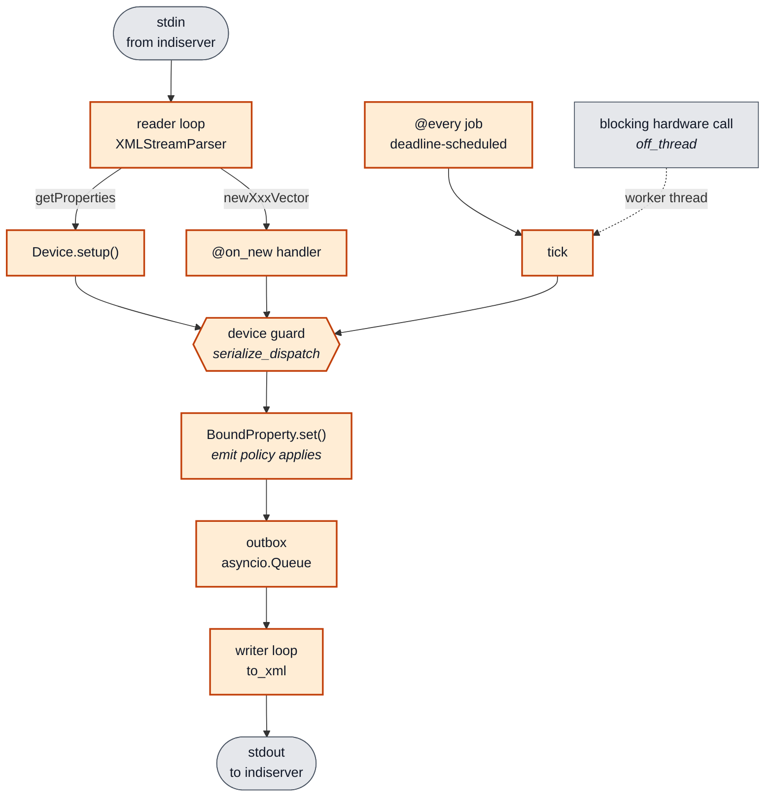

# The Python package

Detail for `src/indi_nexus/`. The repository-wide rules are in the root `CLAUDE.md`.

## Inside a running driver

What the runtime owns, and where the device guard sits. **Keep this current** - it is one of
the two diagrams named in the root file's diagram table.

## `protocol/` - the wire format

The single source of truth for INDI 1.7: typed models, exact wire-token enums, and a real
streaming parser (no runtime DTD reflection, no "accumulate stdin and retry
`etree.fromstring`" framing loop).

- `enums.py` - `IPState`, `IPerm`, `ISRule`, `ISState`, `BLOBPolicy`, each an `enum.StrEnum`
  so a member **is** its wire token (`IPState.OK == "Ok"`) and Pydantic serializes it
  directly.
- `models.py` - the Pydantic models.
  - A **vector** (`NumberVector`, `TextVector`, `SwitchVector`, `LightVector`, `BLOBVector`)
    is the canonical in-memory property, discriminated on `kind`.
  - `def` / `set` / `new` are a wire **intent**, not different data, so they are thin
    wrappers (`DefVector`, `SetVector`, `NewVector`) around a vector rather than five
    duplicated classes each.
  - Element metadata (number `format`/`min`/`max`/`step`, switch `rule`) is optional with
    defaults, because `set`/`one` messages carry only `name` + value. Clients merge `set`
    values onto the previous definition, which is standard INDI behavior.
  - `LightVector` has no `perm`; lights are always read-only in INDI.
  - Handler ergonomics live on the vector: `element(name)`/`[name]` (raising),
    `get(name, default)` (tolerant; BLOBs yield `data`), `values()`, and
    `SwitchVector.selected()`.
  - Non-property messages: `GetProperties`, `DelProperty`, `Message`, `EnableBLOB`. A client
    must send `enableBLOB` before `indiserver` forwards any BLOB.
- `xml.py` - `to_xml(msg)` serializes; `parse_indi(data)` parses a complete chunk;
  `XMLStreamParser` is the incremental parser for a stream (synthetic root, emits depth-1
  elements as they complete, clears consumed nodes so memory stays flat). Number values
  honor the INDI printf `format` including the `%m` sexagesimal form (`format_number` /
  `parse_number` mirror libindi's `fs_sexa` / `f_scansexa`), which is what makes RA/Dec
  interop work.
- `json.py` - the browser codec. `to_json` / `from_json` mirror `to_xml` / `parse_indi` over
  a `TypeAdapter(IndiMessage)` (the `tag` literals discriminate the union). Same models, so
  the JSON *is* the frontend contract; BLOB bytes travel as base64.

## `driver/` - the SDK

What a driver author subclasses. The vocabulary is plain Python: no libindi-C surface
(`IUFind`/`IDSet*`/`IEAddTimer`), no per-tag `ISNew*` dispatch, no class-global registries.

- `device.py` - `Device`. Override `async def setup()` and declare properties with
  `define_number/text/switch/light/blob(...)`, each returning a `BoundProperty` typed by the
  vector kind and emitting the `def`. Reach them later via `self["NAME"]` (untyped, since a
  name lookup cannot know the kind) or the typed getters `self.number/text/switch/light/blob`
  when you need `.vector.elements` narrowed. `self.message()` / `self.log_error()` send INDI
  `message`s; `Device.run()` serves over stdio.
  - `define_connection()` adds the standard `CONNECTION` switch with a built-in handler
    (flip + `on_connect`/`on_disconnect` + announcement). A hook that **raises** rolls the
    switch back and leaves the property `Alert` with the reason, so a device never claims a
    link it does not have. A subclass `@on_new("CONNECTION")` shadows the built-in (the
    handler map keeps the MRO-first entry per property).
  - `await self.off_thread(fn, ...)` runs a **blocking** instrument call in a worker thread.
    This is the answer to the commonest way a real driver goes wrong: calling a synchronous
    vendor library from an `async def` silently stalls the whole reactor. Only the blocking
    call goes to the thread. The outbox behind `set` is an `asyncio.Queue`, so property
    writes stay on the loop.
  - `serialize_dispatch` (class attribute, default `True`) runs `@every` ticks and `@on_new`
    handlers under one per-device lock, so a tick that awaits mid-flight cannot publish
    pre-write state over a client write that landed while it was out. Hardware access ends
    up serialised too, which one serial port wants anyway.
- `property.py` - `BoundProperty[VectorT]`, the driver-side handle around a pure protocol
  vector, generic so `define_switch(...).vector.elements` is a `list[Switch]`.
  - `.set(RA=1.2, state=IPState.OK)` mutates elements **and** emits one `setXxxVector`,
    honoring both exclusive switch rules (`OneOfMany` and `AtMostOne`).
  - `.select(name, value)` is the whole "one of N lights is lit" idiom in one call, the most
    repeated shape in real status reporting; `.set_all(value)` writes every element in one
    emit; `name in prop` asks whether hardware reported something this vector has.
  - A `Text` element coerces a non-string at assignment rather than at serialisation, so a
    bad publish fails at the call site, never inside the writer loop.
  - The `emit` policy chosen at `define_*` time is enforced here: under `"on_change"` values
    are still written but nothing goes on the wire (and the timestamp is untouched) when the
    result matches what clients were last told. `force=True` overrides.
  - The protocol models stay behavior-free. This wrapper is where "and tell the client"
    lives.
- `scheduling.py` - `@every(seconds=, minutes=, hours=)` only *tags* a method;
  discovery and execution are **per instance**, one supervised task each, with per-tick error
  isolation. Ticks run against a rolling **deadline** (in `runtime.py`) rather than sleeping
  the interval after each one, so a job's period does not drift by the tick's own duration.
  `when_connected=True` pauses a job while `device.connected` is false.
- `dispatch.py` - `@on_new("PROP")` tags the handler for client writes; the device builds a
  per-instance name to handler map and passes the fully typed parsed vector. Unhandled
  writes fall through to `on_new_default`.
- `runtime.py` - `DriverRuntime` owns the stdio transport and supervision. It takes plain
  `read`/`write` callables (`ReadFn`/`WriteFn` from `transport.py`), so tests drive it over
  in-memory byte streams exactly as `indiserver` would; `run()` wires real stdin/stdout.
  Plain `asyncio`: an outbox queue, a writer task, one task per periodic job, all driven by
  the reader until stdin EOF. Inbound dispatch has the same error isolation as ticks - a
  raising `@on_new` handler or `setup()` is reported to the client and swallowed, so one bad
  client write never kills the driver.

## `testing.py` - the harness

`DeviceHarness` is the public seam for testing a `Device` and the thing third-party driver
repos depend on. **Treat its surface as API.**

It binds the device's emit callback and records everything. `setup()` sends the
`getProperties` that `indiserver` would. `write(name, **values)` builds the **partial**
vector a real client sends (only the named elements, no `def`-only metadata, no switch
`rule`) and routes it through `Device._dispatch_new`, so the `@on_new` map, the device-name
guard and the serialisation lock are all exercised. `tick(job)` runs one iteration of an
`@every` method by name. Read back with `defs()`, `sets()`, `deletes()`, `messages` and
`latest(name)` (last emission, falling back to the device's live vector so it survives
`clear()`).

Wire-level concerns - framing, chunk boundaries, the codec - still get a `DriverRuntime` over
byte streams (`tests/test_driver.py`). The harness deliberately does not touch XML.

## `client/` - the async client

A reconnecting `asyncio` TCP client to `indiserver` that mirrors server state into a typed
cache, always as protocol models and never raw XML.

- `store.py` - `PropertyStore`, the pure cache (no socket behavior, so trivially testable).
  `apply(msg)` folds one message in following INDI semantics (`def` defines, `set` **merges**
  values and state onto the definition keeping def-only metadata, `del` removes a property or
  a whole device) and returns a `PropertyEvent`. It holds the subscription registry;
  `matching(event)` returns the interested callbacks and the client does the actual dispatch,
  keeping the store pure.
- `client.py` - `IndiClient`. Async context manager or `run()` for monitors. A background
  loop connects, sends `getProperties` and replays any `enableBLOB` policies on every
  reconnect, runs a reader (folds into the store, dispatches to sync **and** async
  subscribers) and a writer, and reconnects with a fixed delay. Reads: `get`, `store`,
  `client[device]`. Watch: `subscribe`, `on_message`, `on_connection`. Scripting: `wait_for`.
  Sends: `get_properties`, `enable_blob`, `set_number/text/switch/blob`. The transport is
  injectable, so tests drive it over in-memory streams. Every ended connection - EOF, error
  or `aclose()` - invokes `close`, so the OS socket never lingers between reconnects.

## `web/` - the bridge

A FastAPI app putting one shared `IndiClient` behind an HTTP/WebSocket surface.

- `bridge.py` - `Bridge` fans client activity out to browser WebSocket sinks: property events
  become `def`/`set`/`delProperty` JSON, `on_message` becomes `message` JSON, and
  `on_connection` becomes a small `{"event":"connection"}` **control** frame (the one
  non-INDI frame; the UI needs it and the protocol has no message for it). `snapshot()`
  primes a new browser with the cache plus a bounded history of recent `message` frames,
  without which a freshly opened page's log would always start empty. `start()` calls
  `IndiClient.start(wait=False)`: the server must come up with `indiserver` down (the state a
  first `indi-nexus serve` usually starts in) and show a disconnected panel rather than hang
  in startup. Scripts and monitors still get the blocking default.
- `app.py` - `create_app(*, client=None, indi_host=, indi_port=)`. Lifespan starts and stops
  the bridge. `GET /health`; `GET /api/devices[/{device}[/{name}]]`; `WS /ws` (snapshot on
  connect, then live, browser frames forwarded upstream); `GET /` serves the built panel,
  falling back to the debug page, which stays at `/debug`. `client` is injectable so tests
  use `TestClient` over an in-memory upstream.
- `static/debug.html` - a self-contained live inspector aimed at driver authors: colour-coded
  property tree, editable RW vectors and clickable switches, and a raw message feed.

## `cli.py`

Typer app, the `indi-nexus` entrypoint. `new` scaffolds a runnable driver file (the template
is import-tested so it cannot rot); `serve` runs the web bridge; `run module:attr` imports a
`Device` subclass and serves it over stdio; `monitor` prints live updates. Heavy imports
(uvicorn, fastapi) are lazy so `--help` stays fast.

## The examples

- `examples/demo_device.py` - the reference driver: one of each vector kind, an `@every`
  animation gated on a power switch, an `@on_new` handler.
- `examples/weather_device.py` - the reference **site** driver: a blocking vendor-style
  client behind `off_thread`, the connection lifecycle, hardware that stops answering, and
  `emit="on_change"` readbacks. **Keep at least one example in this shape** - the simulator
  examples never exercise a slow, absent or lying instrument, which is what real drivers
  spend their bug budget on.
- `examples/openmeteo_device.py` - the same shape against a **real public API**, and what
  `docs/guides/tutorial-open-meteo.md` builds. Its tests run against
  `tests/data/open_meteo_response.json`, a recorded real reply, so the field names are
  checked against what the service actually sends. If you change what the driver requests,
  re-record rather than hand-editing that fixture.
- `examples/monitor_client.py` - the reference client.
- `examples/demo_bridge.py` - driver, bridge and panel over in-memory pipes, so the whole
  stack runs end to end with `python -m examples.demo_bridge` and no `indiserver`.
- `tests/test_integration.py` cross-wires a `DriverRuntime` and an `IndiClient` through
  in-memory pipes: a full round-trip with no `indiserver`.
