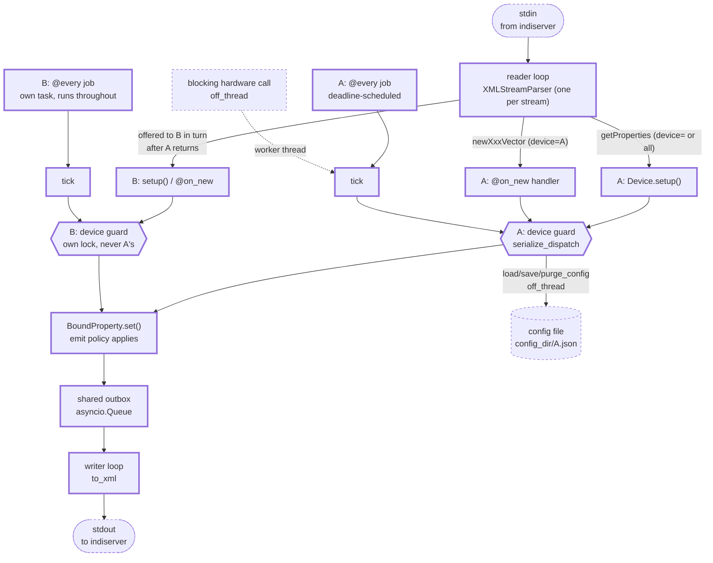

# The Python package

Detail for `src/indikit/`. The repository-wide rules are in the root `CLAUDE.md`.

## Inside a running driver

What the runtime owns, and where the device guard sits. **Keep this current** - it is one of
the two diagrams named in the root file's diagram table.

One runtime serves **one or more** devices: one stdin, one parser, one outbox, one writer,
and a device guard plus a set of `@every` tasks per device. Device B below is every
co-located device, drawn once.

The one edge worth reading twice is `reader -> B`: the reader **awaits** each dispatch, so
while A's handler runs, the next inbound message waits - for every device on the stream.
That is head-of-line blocking in the reader, not lock contention, and neither `off_thread`
nor `serialize_dispatch = False` moves it: a message addressed to A never reaches B's guard
in the first place (both `_dispatch_*` return on the device-name check before entering it),
and `off_thread` still awaits. Outbound is unaffected - one outbox, a separate writer task -
and so are `@every` jobs, which is why B keeps polling and publishing throughout. Two
devices that must never delay each other's writes are two drivers, which `indiserver`
launches happily.

## `exceptions.py` - the error hierarchy

Everything the package raises on purpose derives from **`IndiError`**, so an application
can survive the library with one `except`. Every type **also derives from the builtin that
used to be raised at its site**, which is the whole reason the hierarchy could land without
breaking anything: existing `except KeyError` / `except RuntimeError` / `except ValueError`
in this repository, in the examples and in third-party drivers keeps catching exactly what
it caught before. The builtin comes first in the MRO after `IndiError`, so message
formatting (`KeyError`'s repr-quoting) is unchanged too.

| Type | Also a | Raised when |
|---|---|---|
| `ProtocolError` | `ValueError` | the wire format is violated: junk where a number belongs, a missing `#REQUIRED` attribute, an unknown element kind, a non-finite value neither codec can carry |
| `PropertyNotFound` | `KeyError` | a property or an element is looked up by a name nothing answers to |
| `WrongPropertyKind` | `TypeError` | a property is reached through an accessor for another vector kind, or `select()` has no natural unselected value |
| `PropertyRetracted` | `RuntimeError` | a retracted `BoundProperty` handle is used to publish |
| `DeviceNotServing` | `RuntimeError` | a `Device` sends while not attached to a runtime |
| `NotConnectedError` | `ConnectionError` | `IndiClient` has no live connection, on a send or to fail a parked `wait_for` |
| `SendQueueFull` | `RuntimeError` | the client's outbox is full because the connection stopped draining it |
| `ConfigError` | `OSError` | a device's saved configuration cannot be located, read, written or removed - including "nothing saved yet", which is a first run |

Adding a type here means answering both questions: what it is a kind of (`IndiError`,
always) and which builtin it has to stay compatible with. `tests/test_exceptions.py` asserts
both halves per type, and that is the test that stops the compatibility guarantee rotting.

## `settings.py` and `logging_config.py` - configuration and logging

Both sit at the bottom of the graph on purpose: `settings.py` imports **pydantic-settings,
click, and nothing from `driver/`, `web/` or `client/`**, because both the CLI and `driver.run`
import it, and `logging_config.py` imports only `protocol`. Anything more would put an
edge in the graph `tests/test_layering.py` holds flat.

- `settings.py` - `Settings`, the `INDIKIT_*` environment, and the `settings()` accessor
  (`lru_cache`d; tests call `settings.cache_clear()`). Every default is what the code
  already used, so freezing them as contract changed no behaviour: `connect_timeout=10.0`
  and `reconnect_delay=2.0` from `IndiClient`, `message_history=100` and `max_backlog=512`
  from `bridge.py`, and `token`/`allowed_origins`/`allow_insecure_bind` from `serve`'s own
  flags. `extra="ignore"` is load-bearing, not tidiness: the prefix is not reserved for
  this model - the suite ships `INDIKIT_UPDATE_GOLDEN` and an operator's tooling may
  set anything - and the default `forbid` would take every entrypoint down at once over
  one such name.
  - **One reader.** No Typer option carries an `envvar=` (`tests/test_cli.py` asserts it),
    so within the Python package the whole `INDIKIT_*` environment is read here and
    nowhere else, and a variable has one meaning and one place documenting it. The one
    exception is outside the package: `docker/entrypoint.sh` reads `INDIKIT_TOKEN`,
    `INDIKIT_ALLOW_INSECURE_BIND` and `INDIKIT_ALLOWED_ORIGINS` (as fallbacks for
    `WEB_TOKEN`, `WEB_ALLOW_ANONYMOUS` and `WEB_ALLOWED_ORIGINS`), because it has to
    generate a token and print the panel's URL with it *before* `serve` starts. It passes
    them on as flags, which beat the environment, so `Settings` still resolves one value.
    See `docs/docker.md`. The three that are also `serve` options are resolved in the command
    body against a `None` default: `None` is "flag absent, take the environment" and
    anything else is the operator's explicit choice, which wins. Resolving in the body is
    the whole point - a default computed in the signature is evaluated at *import*, which
    freezes the first environment the process ever saw and is silent about it under any
    in-process runner. `--token ""` is therefore a real value that turns a configured
    token off, and `serve`'s non-loopback refusal is checked against the resolved token,
    not the flag.
  - `config_dir` is the one field with a **`default_factory`**, because its default is
    computed: `INDIKIT_CONFIG_DIR`, else `click.get_app_dir("indikit",
    force_posix=True)` - `~/.indikit` on Linux and macOS alike - else `None`. Click is
    already a hard dependency through Typer, and where an application's configuration
    lives is not a problem to solve here. `force_posix` is the decision: one path on every
    machine an operator administers, sitting beside libindi's own `~/.indi` rather than
    in it. It **ignores `XDG_CONFIG_HOME`**, which the old chain honoured, and that cost
    was taken knowingly - `INDIKIT_CONFIG_DIR` is the escape hatch, and
    `tests/test_settings.py` asserts the XDG variable is not obeyed so nobody restores it
    as a bug fix. The `None` branch is load-bearing: not `Path.home()`, which **raises**
    when there is no home - how a service manager runs a driver - and not a temp
    directory, which would accept every save and lose the lot on reboot. It needs its own
    guard, because `os.path.expanduser` leaves `~` in place rather than raising, so an
    unguarded `get_app_dir` returns the *relative* `~/.indikit` and a driver saves into
    its working directory. `None` is the honest answer and makes the persistence methods
    raise `ConfigError` naming the variable as the fix.
  - `allowed_origins` is a `tuple[str, ...]` read **space separated** from the environment,
    which needs `NoDecode` to stop pydantic-settings JSON-decoding a collection field. An
    origin cannot contain whitespace, and it is what Click already did with a repeatable
    option's `envvar`, so compose files written against the old behaviour keep working.
  - **Nothing reads it implicitly.** `IndiClient`, `Bridge` and `create_app` keep explicit
    parameters with their present defaults, and the entrypoints pass values down. A
    constructor that read `Settings()` itself would destroy the injectability the whole
    suite and `create_app(client=...)` rest on, and would let import order decide
    behaviour.
  - `LogLevel` is a closed `StrEnum` because the level is handed to **uvicorn** as well, at
    both call sites in `cli.py`. A free string makes a typo a traceback out of
    `uvicorn.Config`; the enum makes it a usage error, and `--log-level DEBUG` no longer
    leaves the request log at `info`.
- `logging_config.py` - `configure_logging`, the only handler installation in the package,
  and `log_wire` behind the `indikit.wire` logger.
  - **stderr, not stdout, and it installs the handler outright** rather than deferring
    through `basicConfig`. A driver's stdout *is* the INDI wire (`runtime._open_stdio`
    writes XML to `sys.stdout.buffer`), so a log line there corrupts the stream
    `indiserver` parses - and `basicConfig` defers to a root that already has a handler,
    which under any test runner means installing nothing and holding the stderr guarantee
    only when nothing else got there first.
  - **Exactly one entrypoint per path configures.** The Typer callback for a CLI
    invocation; `driver.run` for a driver. Not `serve_stdio`, which tests and embedders
    await - configuring there would make every one of them mutate global logging. That is
    also why `cli.run_devices` calls `serve_stdio` directly instead of `driver.run`:
    reaching `driver.run` would re-read the environment and throw away `--log-level`.
  - `indikit.wire` is **one** logger for four sites (the client's reader and writer, the
    runtime's reader and writer), because an operator wants one switch for "show me the
    wire", not to learn which module each end lives in. Every call is guarded by
    `isEnabledFor`. A message is named by its **model tag** (`def`, `set`, `new`, ...),
    not by the XML element it would serialise to: the same message travels as JSON to a
    browser, so the XML name would be wrong for half of it, and reproducing the codec's
    tag-stem rule would put a fourth copy of it in the package. A BLOB's payload is never
    logged, only its size, read off the model.

## `protocol/` - the wire format

The single source of truth for INDI 1.7: typed models, exact wire-token enums, and a real
streaming parser (no runtime DTD reflection, no "accumulate stdin and retry
`etree.fromstring`" framing loop).

- `enums.py` - `IPState`, `IPerm`, `ISRule`, `ISState`, `BLOBPolicy`, each an `enum.StrEnum`
  so a member **is** its wire token (`IPState.OK == "Ok"`) and Pydantic serializes it
  directly. `coerce_switch(value)` lives here as well: every API that takes a switch value
  from application code - `BoundProperty.set`, `IndiClient.set_switch`,
  `DeviceHarness.write` - accepts `ISState`, `bool` and the wire token, and this is the one
  implementation of that. It used to be three private copies, one of which `testing.py`
  reached across subpackages to import.
- `models.py` - the Pydantic models.
  - A **vector** (`NumberVector`, `TextVector`, `SwitchVector`, `LightVector`, `BLOBVector`)
    is the canonical in-memory property, discriminated on `kind`.
  - `def` / `set` / `new` are a wire **intent**, not different data, so they are thin
    wrappers (`DefVector`, `SetVector`, `NewVector`) around a vector rather than five
    duplicated classes each. Facts about the *message* rather than the property live on
    the wrapper: `SetVector.state_present` records whether the wire carried a `state`,
    which is `#IMPLIED` on a `set*Vector` and means "no change if absent". Keeping it
    there is what lets `Vector.state` stay non-nullable for every reader of a cached
    property.
  - Every timestamp is UTC. `IndiTimestamp` (an `AfterValidator` around `as_utc`) is the
    one normalisation point: a naive datetime is **read as** UTC, because that is what a
    bare INDI timestamp means, and an aware one is converted. `indi_now()` is the driver
    default - aware UTC truncated to the second, since the XML format has no more
    resolution than that. Assigning straight to a model attribute skips the validator, so
    code that does (`BoundProperty.set`) calls `as_utc` itself.
  - Element metadata (number `format`/`min`/`max`/`step`, switch `rule`) is optional with
    defaults, because `set`/`one` messages carry only `name` + value. Clients merge `set`
    values onto the previous definition, which is standard INDI behavior.
  - `LightVector` has no `perm`; lights are always read-only in INDI.
  - Handler ergonomics live on the vector: `element(name)`/`[name]` (raising
    `PropertyNotFound`), `get(name, default)` (tolerant; BLOBs yield `data`), `values()`,
    and `SwitchVector.selected()`.
  - `detached()` is the one implementation of "a vector handed to someone else is a value":
    a shallow copy plus copied elements, which is all that is needed because every other
    field is an immutable scalar rebound on assignment. Both owners of a live, mutating
    vector use it - the driver's `BoundProperty` for every message it emits, the client for
    every vector `wait_for` resolves with - so the rule cannot drift between them.
  - Non-property messages: `GetProperties`, `DelProperty`, `Message`, `EnableBLOB`. A client
    must send `enableBLOB` before `indiserver` forwards any BLOB.
- `numbers.py` - `format_number` / `parse_number`, the INDI printf `format` including the
  `%m` sexagesimal form, which is what makes RA/Dec interop work. **Not an XML concern**,
  which is why they are not in `xml.py`: the same rendering is what a browser sees through
  the JSON codec, and the driver's `emit="on_change"` policy compares numbers in exactly
  this representation, because "changed" means changed as far as a client can tell. Both
  are exported from `indikit.protocol`, as the TypeScript mirror exports `formatNumber`.
  - `format_number` matches `fs_sexa` including its rounding: half-way values go **away
    from zero**, not to even. This was a **Python-only** divergence - the TypeScript
    mirror in `web/packages/client/src/format.ts` was correct all along - so fix them
    apart, not together. `parse_number` is a deliberate **superset** of `f_scansexa`: it
    reads sexagesimal on the `set` path too, where libindi uses `std::stod` and would read
    `10:30:00` as `10.0`. Keep it; matching libindi there is a data-corruption bug.
- `compression.py` - the INDI `.z` rule, applied on **receive only**. A `format` ending in
  `.z` means the payload was deflated for the wire, so `inflate_blob` inflates it, strips
  the suffix (`.fits.z` -> `.fits`) and sets `size` to the inflated length, which is what
  libindi's `BaseDevicePrivate::setBLOB` does for every client built on it. It is not an XML
  concern - the same models reach a browser as JSON, and a browser has no zlib - so **both
  codecs call it on the way in** and neither one's consumer ever meets a deflated payload.
  Three things about it are load-bearing.
  - **It is RFC 1950, not raw deflate.** The whitepaper's footnote cites RFC 1951, but
    libindi calls zlib's `compress2`/`uncompress`, which carry the 2-byte header and the
    Adler-32 trailer: `zlib.decompress(data)`, never `wbits=-15`.
  - **`.fz` is not `.z`.** FITS tile compression is an astronomy container format, not a
    transport encoding; nothing in the ecosystem un-fpacks it and undoing it needs cfitsio.
    The check is `endswith(".z")` for that reason and `endswith("z")` would corrupt every
    fpacked frame. Real libindi 2.2.4 sends `.fits.fz` under `CCD_COMPRESSION` and `.bin`
    uncompressed on the native path, so its CCD simulator emits no `.z` at all -
    `tests/interop/drivers/zlib_blob_driver.py` is what exercises that path over a real
    `indiserver`.
  - **A payload that will not inflate costs the message.** `ProtocolError` (a `ValueError`),
    so the stream parser's drop-and-count path applies. Delivering the compressed bytes
    instead would hand a caller that asked for `.fits` something it will feed to a FITS
    reader.
  - Compressing on **send** stays the driver author's decision, as it is in libindi (an
    opt-in switch, default off). What `require_declared_size` enforces is that a `.z`
    format carries an explicit `size`: INDI's `size` is the *uncompressed* length, so the
    `len(data)` default is right only for a payload that is neither encoded nor
    compressed. **Both codecs call it**, and that is the point - they serialize the same
    models, so a frame `to_xml` refuses and `to_json` emits is drift between two
    descriptions of one contract, which is the thing the root `CLAUDE.md` keeps them in
    step to avoid. The same rule reaches back into the SDK: `BoundProperty._assign` leaves
    a `.z` element's `size` alone (see `property.py` below).
- `xml.py` - `to_xml(msg)` serializes; `parse_indi(data)` parses a complete chunk;
  `XMLStreamParser` is the incremental parser for a stream (synthetic root, emits depth-1
  elements as they complete, clears consumed nodes so memory stays flat). Number text goes
  through `numbers.py` in both directions.
  - **Nothing a peer sends makes the parser raise.** A raise here escapes the driver
    runtime's per-message isolation (it happens while *iterating* `feed()`) and kills the
    client's reconnect loop, so malformed input is absorbed and counted instead:
    `dropped` for an element whose values would not parse, `resets` for a reopening of the
    document after an unmatched close tag. `resets` is a framing signal, not a loss count.
    Both counters describe **the peer on this stream**, not one lxml object: `resync()`
    rebuilds the parser underneath them and leaves them running. The rule the leniency
    follows: **a leaf may degrade to a representable absence, it may never invent a
    value** - `min=''` becomes `None`, a junk `oneNumber` costs the whole element, because
    `value` is not nullable. A missing `#REQUIRED` `device`/`name` costs the whole
    message for the same reason (`_required`): `""` is not a degraded device, it is an
    invented one, and it used to land in the client's cache as a phantom device nothing
    would ever update. BLOB payloads are decoded **strictly** - whitespace stripped first,
    because real traffic carries the base64 across lines, and validated after, because a
    decoder that silently discards non-alphabet characters turns a corrupt frame into a
    plausible one.
  - **`enclen` is right and `len` is somebody else's leftover.** Neither is in the 1.7 DTD;
    both are libindi extensions with different meanings, written on mutually exclusive
    paths by `IUUserIOBLOBContextOne`: `enclen` is the base64 *character* count on the
    normal inline path, `len` the raw pre-encoding *byte* count on the shared-memory
    attached path. A recording showing `len` on an ordinary frame is `indiserver`'s doing -
    `SerializedMsgWithoutSharedBuffer` strips `attached` and `enclen` when it re-serialises
    for a plain TCP client and never removes the driver's `len`. We emit `enclen` and read
    neither, so an unknown attribute costs nothing. Do not rename it or add `len`. The
    value must exclude newlines, and anything that ever wraps the base64 has to wrap at a
    multiple of 4: libindi's `from64tobits_fast` skips at most one newline per 4-character
    group. We emit one unwrapped line, which satisfies both for free.
  - **Non-finite numbers are refused, in both codecs.** JSON has no literal for NaN or
    the infinities, so `to_json` wrote `null` and `from_json` then rejected its own
    output. `Number.value` forbids them (`allow_inf_nan=False`), `parse_number` raises on
    them so the XML side drops the element, and `_optfloat` degrades a non-finite
    `min`/`max`/`step` to `None` because that field *can* say absent.
  - `stalled` is the backstop for the failure the parser cannot see: lxml can be left
    emitting nothing at all (a root close arriving mid-start-tag), with no event and an
    empty `error_log`. The reader loops watch `bytes_since_last_message` against
    `STALL_THRESHOLD_BYTES` and reconnect (client) or call `resync()` (driver), logging
    the stream's `dropped`/`resets` history as they go. Reopening the document is
    recovery, not progress, so it leaves the counter running: a peer sending nothing but
    close tags trips the stall too, rather than holding the budget at zero forever.
- `json.py` - the browser codec. `to_json` / `from_json` mirror `to_xml` / `parse_indi` over
  a `TypeAdapter(IndiMessage)`. `IndiMessage` carries **`Field(discriminator="tag")`**, as
  `Element` and `Vector` carry `discriminator="kind"`, and that is what makes the union
  **closed**: a frame whose `tag` is missing or unknown is refused, and an invalid frame
  reports one error against the member it named instead of seven parallel ones. It has to
  be declared, not inferred - `GetProperties` defaults every field and `_Model` is
  `extra="ignore"`, so undiscriminated the union matched `{}`, and every other
  unrecognised object, as a `getProperties`. That was a live hole: `Bridge.handle_incoming`
  accepted a browser echoing a bridge **control** frame back up `/ws` and forwarded it
  upstream. Same models, so the JSON *is* the frontend contract; BLOB bytes travel as
  base64 in the **standard** alphabet, which `BLOB.data` pins with a field serializer
  because pydantic's `ser_json_bytes="base64"` emits the URL-safe one, and both `atob` and
  a `data:...;base64,` URL reject `-`/`_` outright - the panel's download link is exactly
  such a URL. Validation still takes either alphabet, which is why nothing caught it: the
  payload round-tripped through our own stack perfectly and failed only in a browser.

## `driver/` - the SDK

What a driver author subclasses. The vocabulary is plain Python: no libindi-C surface
(`IUFind`/`IDSet*`/`IEAddTimer`), no per-tag `ISNew*` dispatch, no class-global registries.

- `device.py` - `Device`. Override `async def setup()` and declare properties with
  `define_number/text/switch/light/blob(...)`, each returning a `BoundProperty` typed by the
  vector kind and emitting the `def`. Reach them later via `self["NAME"]` (untyped, since a
  name lookup cannot know the kind) or the typed getters `self.number/text/switch/light/blob`
  when you need `.vector.elements` narrowed. `self.message()` / `self.log_error()` send INDI
  `message`s; `Device.run()` serves over stdio.
  - A `setup()` that **raises** is a retry, not a death sentence: the `@every` gate opens
    anyway (a driver whose jobs never run is dead while still looking alive to
    `indiserver`, and a job is the only thing left that can notice hardware appearing),
    and the attempt is not latched, so a later `getProperties` runs `setup()` again. The
    failed attempt is **rolled back** the way a raising `on_connect` is: everything it
    defined before raising is retracted with a `delProperty` and dropped, so a partial
    probe never leaves a channel announced that the retry does not define again. The
    handles it returned die with it - `set()` on one raises - so reach properties through
    `self["NAME"]` rather than caching a handle across a failed setup.
  - `delete_property(name, message=None)` is the counterpart to `define_*`: it **removes**
    the property from the device and *then* emits the `delProperty`, so a later
    `getProperties` cannot re-announce something the driver withdrew. An unknown name is a
    silent no-op - no wire traffic, no raise - which is what lets a disconnect hook retract
    unconditionally, the way the whole libindi corpus does. Nothing is protected, including
    `CONNECTION`; libindi guards nothing here either, and a device that deletes its
    `CONNECTION` is simply a device without connection semantics from then on. Define,
    delete and define again is the **normal** life of a property (once per connect cycle,
    for the life of the process), not an edge case, so keep the re-define path clear.
  - `define_connection()` adds the standard `CONNECTION` switch with a built-in handler
    (flip + `on_connect`/`on_disconnect` + announcement). A hook that **raises** rolls the
    switch back and leaves the property `Alert` with the reason, so a device never claims a
    link it does not have. A subclass `@on_new("CONNECTION")` shadows the built-in (the
    handler map keeps the MRO-first entry per property).
  - `define_config()` adds the standard `CONFIG_PROCESS` switch (`CONFIG_LOAD` / `CONFIG_SAVE`
    / `CONFIG_PURGE`, `AtMostOne`) with a built-in handler over `load_config()`,
    `save_config()` and `purge_config()`. Four things about it are settled and each was got
    wrong once.
    - **It defines a property and does no I/O.** Restoring is `await self.load_config()`,
      written in `setup()`. An async `define_*` would be the only one in the SDK, blocking
      I/O in a sync method breaks the rule `off_thread` exists to teach, and
      `asyncio.create_task` would run the load *after* the `define_*(persist=True)` calls
      below it in the same `setup()` body, which is exactly the ordering that must hold.
    - **The handler resets the switch to all-Off** after acting. `_on_connection_write` is
      the model for its *reporting* (Busy, act, Ok/Alert, shadowable) and deliberately not
      for its latching: `CONNECTION` is state, `CONFIG_PROCESS` is a momentary action, and
      under `AtMostOne` a member left on stays selected forever - a panel button stuck in
      its pressed position. libindi calls `IUResetSwitch` here for the same reason.
    - **One authoritative `_config_values` map**, not a write-once cache, which cannot tell
      "never restored" from "restored and since changed by the operator". Its four rules are
      the whole design, and each closes a data-loss path: `load_config()` merges the file in,
      applies it to every persisted property defined *now* **and** leaves it in place for
      every one defined later; `define_*(persist=True)` applies it *before* `_announce()`, so
      startup puts one frame on the wire instead of a default and a correction; withdrawing
      a persisted property captures its live values first, so redefine-after-delete restores
      what the operator had rather than what is on disk; and `save_config()` refreshes from
      the live persisted properties then writes the whole map, so a Save taken while a
      connect-time property is withdrawn does not erase it.
    - **Values, never definitions**, as JSON under `config_dir`, never libindi's
      `~/.indi/<device>_config.xml` - a colliding filename with a different schema is two
      frameworks fighting over one file. `CONFIG_DEFAULT` is not published: the code is
      already the definition of default. `persist=True` on a light or a BLOB raises at
      define time.
    - **`INDIKIT_CONFIG_PERSISTED` is what `persist=` being declarative bought.** A read-only
      text property, one element (`PROPERTIES`) holding the persisted property names
      separated by spaces, published by `define_config()`'s device once `setup()` returns
      and re-`set` when the membership really changes. libindi cannot answer this at all -
      `saveConfigItems` is a C++ virtual nothing on the wire exposes - so the panel's
      apology is right there and wrong here, and `DeviceConfigDialog` now names the
      properties for a driver that publishes it. Five things about it are settled.
      - **The name is namespaced deliberately.** A bare `CONFIG_PERSISTED` shares a flat
        namespace with every future libindi `CONFIG_*`, and once shipped the SDK, the panel
        and any third-party consumer all key on it, so a collision could only be resolved by
        breaking all three together.
      - **Published once, after `setup()`, not per `define_*`.** Emitting as each persisted
        property is defined would announce a list that is wrong until the last one and put a
        `set` on the wire for each. It carries `emit="on_change"`, so a
        define-delete-define cycle that lands on the same membership says nothing.
      - **Empty is an answer.** A device with `define_config()` and nothing persisted
        publishes it with an empty value; only the property being *absent* means "cannot
        tell you", and the panel renders those two differently.
      - **It lists what is defined right now**, so a connect-time persisted property joins
        it on connect and leaves on disconnect - even though a Save still writes that
        property's captured values from `_config_values`. The list answers "which of the
        properties you can see does Save write", and a client has been sent a
        `delProperty` for the other one.
      - The space-separated encoding is safe only because `define(persist=True)` **refuses
        a name containing whitespace**. Nothing in INDI forbids one (`models.py` puts no
        pattern on `name`, the DTD types it CDATA), so that guard is not a restatement of
        the protocol and must not be deleted as one - the reason is written at it.
  - `await self.off_thread(fn, ...)` runs a **blocking** instrument call in a worker thread.
    This is the answer to the commonest way a real driver goes wrong: calling a synchronous
    vendor library from an `async def` silently stalls the whole reactor. Only the blocking
    call goes to the thread. The outbox behind `set` is an `asyncio.Queue`, so property
    writes stay on the loop.
  - `serialize_dispatch` (class attribute, default `True`) runs `@every` ticks and `@on_new`
    handlers under one per-device lock, so a tick that awaits mid-flight cannot publish
    pre-write state over a client write that landed while it was out. Hardware access ends
    up serialised too, which one serial port wants anyway.
- `property.py` - `BoundProperty[VectorT]`, the driver-side handle around a pure protocol
  vector, generic so `define_switch(...).vector.elements` is a `list[Switch]`.
  - `.set(RA=1.2, state=IPState.OK)` mutates elements **and** emits one `setXxxVector`,
    honoring both exclusive switch rules (`OneOfMany` and `AtMostOne`).
  - `.select(name, value)` is the whole "one of N lights is lit" idiom in one call, the most
    repeated shape in real status reporting; `.set_all(value)` writes every element in one
    emit; `name in prop` asks whether hardware reported something this vector has.
  - `.delete()` is the handle-shaped half of `Device.delete_property`; both go through this
    one implementation, so removal and announcement cannot drift apart. The rule is that a
    handle retracts **exactly the property it owns** and says nothing at all when it owns
    nothing - already retracted, or superseded by a redefinition under the same name, where
    emitting a `delProperty` would make every client drop the replacement. It stamps a
    timestamp, as libindi's `IDDelete` does. The handle is the wrong shape for the
    repeated-disconnect idiom, because `self["NAME"]` raises once the property is gone;
    reach for the name-based call there.
  - **Every element value is coerced or refused at assignment, never at serialisation**, so
    a bad publish fails at the call site that caused it instead of inside the writer loop a
    long way away - or, worse, on the wire. A `Text` takes `str(value)`. A `Number` goes
    through `float(value)`, which accepts an int, a bool or a numeric string (a vendor
    library handing back `"2.5"` is ordinary) and raises `ProtocolError` for anything else,
    and then refuses a non-finite result for the reason `Number.value` forbids one on the
    model. Both are load-bearing because assigning to a model attribute **skips pydantic's
    validation entirely**: before the `float()`, a string sailed into a number element and
    sat there looking like a reading. `docs/guides/writing-drivers.md` quotes the
    non-finite message verbatim and `tests/test_docs_snippets.py` checks it, so keep the
    text `... cannot be set to <value!r>` intact.
  - A **BLOB** gets its `size` derived from the payload - except on a `.z` element, where
    the payload is deflated and `len(data)` would put the compressed length under an
    attribute INDI defines as the uncompressed one. That was silent: a plausible integer
    nothing downstream questions. Leaving it alone means the driver states it (once at
    define time - how well a frame compressed does not change how big it is), and a driver
    that states nothing gets `require_declared_size`'s refusal out of the codec instead of
    a wrong frame. `tests/interop/drivers/zlib_blob_driver.py` publishes exactly this way
    against a real `indiserver`.
  - The `emit` policy chosen at `define_*` time is enforced here: under `"on_change"` values
    are still written but nothing goes on the wire (and the timestamp is untouched) when the
    result matches what clients were last told. `force=True` overrides.
  - The protocol models stay behavior-free. This wrapper is where "and tell the client"
    lives.
  - **A message leaving here carries a detached copy of the vector, never the live one.**
    `BoundProperty` owns the only mutable vector a driver has, so it is the only place that
    can leak one, and it builds every vector-carrying message itself (`_detached`, over the
    model's shared `Vector.detached()`, and `_announce` for the `def` that `Device.define`
    used to construct). The outbox is a
    queue drained by a separate writer task, so a handler that reports `Busy`, works, then
    reports `Ok` would otherwise serialise both frames from the same object after both
    mutations and put `Ok` on the wire twice. That is the commonest shape in a driver, and
    it was silently broken. Do not reintroduce a `SetVector(vector=self._vector)` anywhere.
- `scheduling.py` - `@every(seconds=, minutes=, hours=)` only *tags* a method;
  discovery and execution are **per instance**, one supervised task each, with per-tick error
  isolation. Ticks run against a rolling **deadline** (in `runtime.py`) rather than sleeping
  the interval after each one, so a job's period does not drift by the tick's own duration.
  `when_connected=True` pauses a job while `device.connected` is false.
- `dispatch.py` - `@on_new("PROP")` tags the handler for client writes; the device builds a
  per-instance name to handler map and passes the fully typed parsed vector. Unhandled
  writes fall through to `on_new_default`.
- `runtime.py` - `DriverRuntime` owns the stdio transport and supervision. It takes plain
  `read`/`write` callables (`ReadFn`/`WriteFn` from `transport.py`), so tests drive it over
  in-memory byte streams exactly as `indiserver` would; `run()` wires real stdin/stdout.
  Plain `asyncio`: an outbox queue, a writer task, one task per periodic job, all driven by
  the reader until stdin EOF. Inbound dispatch has the same error isolation as ticks - a
  raising `@on_new` handler or `setup()` is reported to the client and swallowed, so one bad
  client write never kills the driver.
  - **`devices` is one device or a sequence of them**, and everything above is shared by
    all of them: one parser (there is one stdin), one outbox, one writer. What is per
    device is the guard, the `setup()` gate and the `@every` tasks. Duplicate device names
    and an empty sequence both raise `ValueError` at construction - two devices answering
    to one name is unresolvable by any client, and both guards would take every message
    addressed to it. `Device.run()` is unchanged and still the single-device path; its
    function-local import of `run` is what keeps `driver.device -> driver.runtime` out of
    the module graph, and `tests/test_layering.py` enforces that.
  - Error attribution differs by direction, because the two ends know different things.
    **Inbound** already has the device it dispatched to, so it reports through that
    device's own `log_error` - which matters most for a failing `setup()`, whose
    `getProperties` usually names no device to guess from. **Outbound** has only the
    message, so `_owner(msg)` resolves the device off the model and `_report` queues the
    `[ERROR] `-prefixed `message` itself. The prefix is not decoration: `Device.message`
    writes `f"[{level}] {text}"`, and dropping it would change the panel's log format for
    runtime errors alone. The writer loop splits its two failures the same
  way: a message that will not **serialise** is reported and dropped, while a failed
  **write** has lost the only channel it could be reported on, so it propagates and
  `serve()` shuts the driver down rather than leaving a mute driver that still looks
  connected to `indiserver`. A driver cannot reconnect its way out of trouble, so
  a `stalled` parser is replaced in place and the stream resyncs on the next well-formed
  element.

## `testing.py` - the harness

`DeviceHarness` is the public seam for testing a `Device` and the thing third-party driver
repos depend on. **Treat its surface as API.**

It binds the device's emit callback and records everything. `setup()` sends the
`getProperties` that `indiserver` would. `write(name, **values)` builds the **partial**
vector a real client sends (only the named elements, no `def`-only metadata, no switch
`rule`) and routes it through `Device._dispatch_new`, so the `@on_new` map, the device-name
guard and the serialisation lock are all exercised. `tick(job)` runs one iteration of an
`@every` method by name. Read back with `defs()`, `sets()`, `deletes()`, `messages` and
`latest(name)` (last emission, falling back to the device's live vector so it survives
`clear()`).

Failures are **not** isolated here, unlike in the runtime: a raising handler or tick comes
out of `write()`/`tick()` with its traceback, because in a test the runtime's swallow-and-
report would turn a bug into a missing emission and an assertion failure far from its
cause. The runtime's isolation is covered where it lives, in `tests/test_driver.py`.

Wire-level concerns - framing, chunk boundaries, the codec - still get a `DriverRuntime` over
byte streams (`tests/test_driver.py`). The harness deliberately does not touch XML.

## `client/` - the async client

A reconnecting `asyncio` TCP client to `indiserver` that mirrors server state into a typed
cache, always as protocol models and never raw XML.

- `store.py` - `PropertyStore`, the pure cache (no socket behavior, so trivially testable).
  `apply(msg)` folds one message in following INDI semantics (`def` defines, `set` **merges**
  values and state onto the definition keeping def-only metadata, `del` removes a property or
  a whole device) and returns a `PropertyEvent`. A `set` that carried no `state` leaves the
  cached one alone (`SetVector.state_present`), so a property latched into `Alert` stays
  there. A **named** `del` removes only that property and leaves the device standing even
  when it was the last one: "here but publishing nothing" is where a driver that defines on
  connect sits while disconnected, and it is not the same as the device being gone, which is
  what an unnamed `delProperty` means. Both of those wire rules have three implementations -
  here, `web/packages/client/src/store.ts` and `web/static/debug.html` - so a change to
  either belongs in all three. A `del` event also carries the `delProperty`'s `message` and
  `timestamp`, since it has no vector to hang them on and the text is usually the only
  account of *why* the property went away. It holds the
  subscription registry; `matching(event)` returns the interested callbacks and the client
  does the actual dispatch, keeping the store pure. A **whole-device** `del` matches every
  subscriber for that device, including the name-filtered ones: its event carries no name
  because the deletion names no property - it takes all of them - so matching the filter
  literally silenced exactly the watchers with the most to lose, and `subscribe(cb,
  device="CCD", name="EXPOSURE")` heard nothing when the CCD's driver crashed and the whole
  device went away.
- `client.py` - `IndiClient`. Async context manager or `run()` for monitors. A background
  loop connects, sends `getProperties` and replays any `enableBLOB` policies on every
  reconnect, runs a reader (folds into the store, dispatches to sync **and** async
  subscribers) and a writer, and reconnects with a fixed delay. Reads: `get`, `store`,
  `client[device]`. Watch: `subscribe`, `on_message`, `on_connection`. Scripting: `wait_for`.
  Sends: `get_properties`, `enable_blob`, `set_number/text/switch/blob`. The transport is
  injectable, so tests drive it over in-memory streams. Every ended connection - EOF, error
  or `aclose()` - invokes `close`, so the OS socket never lingers between reconnects.
  Subscriber callbacks are application code and are isolated in the one `_invoke` funnel:
  a raising callback is logged, not allowed up through the reader where it would look
  exactly like a dropped server. A parser that has gone mute (`stalled`) ends the
  connection, and the reconnect is what resyncs.
  - **A send with no connection raises `NotConnectedError`; it is never queued.** This is
    instrument control: a command held while `indiserver` is down would be delivered
    whenever the hub came back, to hardware whose state has nothing to do with the one the
    caller was reasoning about. Every helper routes through `send`, the outbox is bounded
    (`_OUTBOX_MAXSIZE`, overflow raises `SendQueueFull` rather than blocking) and it is
    **emptied when a connection ends**, so it only ever holds traffic for the connection
    that is up right now. The per-connection handshake - the `getProperties` and the
    replayed BLOB policies - goes straight to the outbox instead, because it describes the
    connection rather than a user's intent. `enable_blob` **records the policy even when
    the send raises**: a BLOB policy is a standing, idempotent subscription preference that
    the handshake replays anyway, not a command to an instrument.
  - **The parser is per connection, and holding it on `self` must not change that.**
    `_reader_loop` calls `_new_parser()` as its first statement and nowhere else; the
    stall path ends the connection precisely so the reconnect hands it a parser with no
    half-open lxml document in it. Assign it once at construction instead and everything
    still passes except stall recovery, silently, and only against a peer that has
    actually gone mute - which is what `tests/test_client.py`'s
    "replaced on every connection" test exists for.
  - `stats` -> `ClientStats` is the operational read, and `/health` reports it. Three
    definitions are contract rather than convenience: `reconnects` counts **successful**
    re-establishments only (a bridge that never reached the hub reports `0` with
    `connected` false, which already tells that story, while a rising count means real
    flapping); `last_message_age_seconds` measures the last **parsed** message, because
    `bytes_since_last_message` already answers the byte question and a peer dribbling
    junk must not look healthy on both; `uptime_seconds` is the **current connection**,
    `None` while down, since the container runtime already reports process uptime.
    The `_total` counters add the **live** parser's numbers at read time rather than
    folding it when it retires - folding on retirement left `dropped_total < dropped` for
    the whole life of every connection, and permanently short after `aclose()`, which is
    exactly when someone asks.
  - `wait_for` hands back a **detached snapshot**, taken at the moment the predicate
    passed, and `aclose()` fails every parked waiter with `NotConnectedError`. Both are the
    same class of bug: one read() chunk is folded in entirely before the reader yields, so
    a `Busy, Ok, Busy` burst resolved a `state == OK` wait and then mutated the live vector
    the waiter was about to read; and a waiter parked on its own future was untouched by
    `aclose`, so it hung forever or sat out its whole timeout. Read the live cached vector
    through `get` when that is what you want.

## `hub.py` - the in-process stand-in for `indiserver`

`InProcessHub` runs drivers in the calling process over in-memory pipes and hands back the
`(read, write, close)` trio an `IndiClient` connects with, so the whole stack runs with no
`indiserver` to install. `indikit serve --device` is its loudest caller, and
`tests/test_examples.py` uses it directly.

It lives here rather than in `web/` because **nothing in it is web-specific** - it is
drivers, pipes and the transport contract - and its old home was the single upward edge in
the import graph: importing the browser-facing package pulled in the whole driver SDK.
There is deliberately **no re-export** from `indikit.web`; one would put that edge back.

Still a development convenience and not a hub: one client, no access control, dies with
the process.

## `web/` - the bridge

A FastAPI app putting one shared `IndiClient` behind an HTTP/WebSocket surface. It imports
only **downwards** - client, protocol, exceptions - and `tests/test_layering.py` holds it
there, along with the whole package's freedom from import cycles.

- `control_frames.py` - the three **control** frames, the non-INDI half of the browser
  contract: `hello`, `connection`, `error`. Models rather than hand-built dicts for the
  same reason the INDI messages are - `web/packages/client/src/types.ts` is a hand-authored
  mirror, and a frame assembled with `json.dumps` at three call sites has no schema for the
  mirror to be checked against. `BridgeFrame` is discriminated on `event` exactly as
  `IndiMessage` is on `tag`.
  - `BRIDGE_PROTOCOL_VERSION` versions **this** contract, not INDI's frozen 1.7, and is
    bumped only on a breaking change: a field removed, renamed, or given a new meaning.
    Adding an optional field does not bump it, because an older client ignoring an unknown
    key is already correct. It stays a **model default**, so a bump shows up in the golden
    schema diff, which is the diff a reviewer should be made to read.
  - `HelloFrame.server` has **no model default**, and that is load-bearing: a model default
    lands in `model_json_schema()`, so pinning `__version__` there would fail
    `tests/test_wire_contract.py` on every release and train whoever cuts it to regenerate
    the golden file without reading it. `Bridge.__init__` takes it as a *function* default
    instead, which is a different thing.
- `bridge.py` - `Bridge(client, server=__version__, *, message_history=, max_backlog=)`
  fans client activity out to browser WebSocket sinks: property events
  become `def`/`set`/`delProperty` JSON, `on_message` becomes `message` JSON, and
  `on_connection` becomes a small `{"event":"connection"}` control frame. The **first**
  frame on every socket is the `hello`: it names the contract version everything after it
  is written in, so it cannot follow the frames a browser needs it to interpret. It rides in
  `Subscription.preamble`, which `_pump` drains ahead of `seed_vectors`, then `seed_frames`,
  then the live queue - `attach` stays synchronous and gains no `await`. `start()` calls
  `IndiClient.start(wait=False)`: the server must come up with `indiserver` down (the state a
  first `indikit serve` usually starts in) and show a disconnected panel rather than hang
  in startup. Scripts and monitors still get the blocking default.
  - **A browser is a subscriber, never something the upstream task awaits.** `attach(sink)`
    returns a `Subscription`: a bounded queue plus its own pump task, and `_broadcast` is a
    plain `def` that appends and returns. Every broadcast originates in `IndiClient`'s one
    `_loop_task` - property events and messages through the reader, the connection frame
    through the connection loop - so awaiting a socket there let one browser under TCP
    back-pressure stall the upstream stream for everyone, and eventually stall the parser on
    a healthy connection. `_invoke` dispatches through `inspect.isawaitable`, which is what
    lets a synchronous subscriber exist at all.
  - **`attach` is synchronous, and that is the whole atomicity argument.** Reading the cache,
    building the seed and joining the subscriber set happen with no `await` between them, so
    nothing can land in the window the old route had between sending the snapshot and
    registering the socket. `Bridge.__init__` creates no loop-bound object for the same
    reason: it runs inside `create_app`, outside any loop. A refactor that makes either one a
    coroutine reopens the hole silently, so `tests/test_web.py` asserts `attach` is not one.
  - The seed holds vector **references**, not JSON, so N browsers attaching to a large cache
    do not buffer N copies of it before a byte drains; the pump serializes at drain rate. The
    cache mutates in place, so a `def` may serialize newer than the property was at attach
    time - the queued `set` frames that follow are equal-or-newer and the browser converges,
    which is exactly what last-writer-wins `set` means.
  - A queued `set` **coalesces**: the next `set` for the same property replaces it in place.
    A `def` or `del` invalidates that slot, so a later `set` cannot fold into one sitting
    ahead of a retraction and overtake it - the correctness condition the whole scheme turns
    on. `message` frames are a log and always append. Past `max_backlog` live frames the
    browser is dropped, counted (`dropped_slow_sinks`, reported on `/health`) and logged; it
    reconnects and re-seeds. A browser cannot tell that from a network fault, which is
    accepted, because the remedy is identical either way.
  - **BLOBs coalesce too, so a slow browser gets the latest image and not every image.**
    That is settled, not an oversight, and three things hold it there. The bridge could not
    be lossless for BLOBs under *any* policy: `PropertyStore` overwrites the payload in the
    cached vector in place, so once the next exposure lands there is nothing behind the queue
    to replay from. `max_backlog` counts **frames**, so queueing every image would remove the
    memory bound outright - thirty 8 MiB frames measure at 372 MiB, a browser at the cap
    projects to gigabytes, and the process dies before `dropped_slow_sinks` can record
    anything, because that counter fires on frame count. And INDI 1.7 licenses it in as many
    words: a server may drop BLOBs arriving faster than a slow recipient accepts them, and
    must not block writing a large one to a slow client. `indiserver` itself never coalesces
    but bounds by **bytes** instead, and gives a `.fits` capture no relief at all before
    killing the client at 128 MB.
    - The skipping is silent to the browser, so it is counted: `coalesced_blobs`, on
      `/health` beside `dropped_slow_sinks`. **Only BLOB coalescing** - a temperature readout
      coalesces constantly and by design, and a count over every frame kind would run away in
      the first minute and say nothing. Adding the field is not a `BRIDGE_PROTOCOL_VERSION`
      change: `/health` is not the browser contract.
    - Anything that has to collect **every** exposure wants a Python `IndiClient` on TCP,
      which does not coalesce; `examples/blob_receiver.py` is exactly that program.
  - `handle_incoming` accepts only what a client may send (`new*`, `getProperties`,
    `enableBLOB`) and answers anything it refuses - a malformed frame, a `def` from a
    browser, `NotConnectedError`, `SendQueueFull` - with an `{"event":"error"}` control frame
    to that browser alone, leaving the socket open. Silence would be a regression: sends are
    no longer queued for a later connection, so a browser that hears nothing has no reason
    not to believe its write landed. `enableBLOB` goes through `IndiClient.enable_blob`, not
    `send`, so the policy is recorded and replayed on every reconnect.
- `security.py` - `WebSecurity`: the `Origin` allowlist and the optional shared token, as
  pure functions over header strings. **`/ws` is the entire write surface**, and browsers
  apply neither the same-origin policy nor CORS to WebSockets, so the origin check is *the*
  control against cross-site WebSocket hijacking rather than defence in depth on top of one.
  Same-origin is always accepted, configured origins by name, `"*"` by choice. **A missing
  `Origin` is allowed on purpose**: a browser always sends one, so refusing it stops no
  browser and breaks every non-browser peer, `TestClient` and the interop suite included.
- `app.py` - `create_app(*, client=None, indi_host=, indi_port=, token=None,
  allowed_origins=(), connect_timeout=, reconnect_delay=, message_history=,
  max_backlog=)`. The four tuning arguments default to today's constants and are what
  `indikit serve` fills from `Settings`; nothing here reads the environment, which is
  what keeps `create_app(client=...)` injectable. Lifespan starts and stops the bridge.
  `GET /health` - **purely additive**: `status`, `connected` and `dropped_slow_sinks` keep
  their names at the top level, because an operator's monitoring check already reads them,
  and `protocol`, `sinks_attached` and the `upstream`/`parser` blocks were added beside
  them rather than by nesting those three. No release version: it hands an unauthenticated
  caller the exact build to look up advisories against, and `protocol` (item A's integer,
  the same one the `hello` carries) answers the only compatibility question a caller has.
  No addresses and no device names either;
  `GET /api/devices[/{device}[/{name}]]` - annotated `dict[str, Vector]` / `Vector`, so
  FastAPI serialises through the real schema and OpenAPI documents it instead of `object`;
  the payload is byte-identical to the old explicit `model_dump`, and the cost is that a
  response model re-validates on the way out, which is right on a snapshot endpoint and
  would not be on `/ws`. The shape stays **bare vectors keyed by property name**: a REST
  resource is the property, not a wire event. `WS /ws` (origin and token checked before
  `accept()`, then `bridge.attach`, then browser frames forwarded upstream); `GET /` serves
  the built panel, falling back to the debug page, which stays at `/debug`. `client` is
  injectable so tests use `TestClient` over an in-memory upstream. The token guards `/ws` and
  `/api` (a full read of instrument state) and never `/health`, which the image's
  `HEALTHCHECK` calls unauthenticated. There is no cookie and no session, deliberately: a
  credential minted to any caller is an origin check wearing a costume, and with no ambient
  credential cross-origin JS cannot authenticate to `/api` at all. `Authorization: Bearer`
  is the form everywhere; `?token=` is accepted on **`/ws` alone** (`_ws_token`, against
  `_bearer_token` for `/api`), because a browser cannot set a header on a WebSocket
  handshake and has no other way in. That argument does not reach `/api`, where an HTTP
  caller can always send the header and a URL token would land in reverse-proxy and CDN
  access logs and in browser history.
- `static/debug.html` - a self-contained live inspector aimed at driver authors: colour-coded
  property tree, editable RW vectors and clickable switches, and a raw message feed.

## `cli.py`

Typer app, the `indikit` entrypoint. `new` scaffolds a runnable driver file (the template
is import-tested so it cannot rot); `serve` runs the web bridge; `run module:attr ...` imports
one or more `Device` subclasses and serves them over one stdio pipe; `monitor` prints live updates. `serve` **refuses
a non-loopback `--host` with no `--token`** unless `--allow-insecure-bind` says so: that bind
publishes the instrument's control surface, and it should be a decision rather than a
default. `--allow-origin` (repeatable) names browser origins besides the server's own.
Those three options carry **no `envvar=`**: they default to `None` and are resolved
against `Settings` in the body, so the flag beats the environment and the refusal is
checked on the resolved value - see `settings.py` above for why the resolution cannot move
into the signature. Heavy imports
(uvicorn, fastapi) are lazy so `--help` stays fast.

`@app.callback()` carries `--log-level` / `-v` / `--wire`, so all four subcommands have
them, and it is the one place a CLI invocation configures logging. `serve` reads the
chosen level back off `ctx.obj` and hands it to **both** uvicorn call sites (`uvicorn.run`
and `uvicorn.Config`), keeping uvicorn's own `log_config` - owning that tree would mean
reimplementing its access-log format for nothing. `run_devices` lives here rather than
being `driver.run` re-exported: `driver.run` configures logging from the environment
itself, and reaching it from the CLI would do that twice and discard `--log-level`.

## The examples

**Every example driver calls `define_connection()`, without exception.** `CONNECTION` is
the property a client looks for first, libindi's `INDI::DefaultDevice` provides it
implicitly, and an example without one teaches a device shape that does not exist in the
field. That means all four of these, not just the first:

- `define_connection()` is the first line of `setup()`.
- Every `@on_new` handler opens with `if not self.require_connected(): return`. **One
  sanctioned exception**, and only one: `openmeteo_device._move_site` checks
  `self.connected` mid-handler instead - in `_apply_site`, the shared body it and
  `on_config_loaded` both call - because the site is the driver's own configuration
  rather than a command to hardware and an operator may move it while disconnected. The
  reason is written at that method; do not re-file it as a violation, and do not add a
  second exception without writing the same kind of argument.
- A job that touches hardware is `@every(..., when_connected=True)`.
- `on_disconnect()` leaves the instrument safe and its properties `Idle`, so nothing keeps
  reading live after the client has gone. Skip `on_connect()` when there is genuinely
  nothing to open; an empty override teaches nothing.
  - **Settle the state; do not invent the element values.** A vector whose members
    describe *physical* state (`CCD_COOLER`'s `COOLER_ON`/`COOLER_OFF`) gets
    `set(state=IPState.IDLE)` and nothing more, because the hook did not switch the
    hardware and a property that claims it did is worse than one admitting nothing is
    driving it. A vector whose members state a *request* (`TELESCOPE_PARK`, where
    `PARK=On` is written when the park is asked for) has its claim retracted when the
    request never came true. Both rules are worked in the examples, and each was got
    wrong once.

The same rule holds for the TypeScript simulators that mirror these drivers, which is
`web/CLAUDE.md`'s problem but the same requirement.

The reading order the docs now state is **`flat_panel.py`, then `weather_device.py`**, and
everything else is picked by need. Keep `docs/guides/examples.md` and `README.md` saying
the same thing; they disagreed for a while and the two front doors sent readers to
different files.

- `examples/flat_panel.py` - the shortest thing here that is still a real driver, and what
  `docs/guides/writing-drivers.md` and `docs/index.md` build. The first thing a newcomer
  reads.
- `examples/demo_device.py` - the sampler and the **generic fixture**: a number, a text, a
  light and a switch vector (no BLOB; `ccd_device.py` has that), an `@every` animation
  gated on both the connection and a power switch, an `@on_new` handler. It is what
  `tests/test_cli.py`, `tests/test_integration.py`, `DEVELOPMENT.md` and two `cli.py`
  docstrings use as a stand-in driver, which is most of why it stays. It is **not** the
  file to send a newcomer to second.
- `examples/weather_device.py` - the reference **site** driver, and the second thing a
  newcomer reads: a blocking vendor-style client behind `off_thread`, the connection
  lifecycle, hardware that stops answering, `emit="on_change"` readbacks, and the one
  worked example of a **connect-time property** (`SENSOR_INFO` defined in `on_connect`,
  `delete_property`'d in `on_disconnect`), which is the API `writing-drivers.md` teaches
  and `harness.deletes()` asserts on. **Keep at least one example in this shape** - the
  simulator examples never exercise a slow, absent or lying instrument, which is what real
  drivers spend their bug budget on. Its element names are lowercase because they come from
  `slugify`; `openmeteo_device.py` spells the same readings `UPPER_CASE` by hand, and the
  divergence is deliberate.
- `examples/openmeteo_device.py` - the same shape against a **real public API**, and what
  `docs/guides/tutorial-open-meteo.md` builds. It is also the worked example of
  **persistence**: `define_config()`, `persist=True` on the site, an explicit
  `await self.load_config()` in `setup()`, and an `on_config_loaded` that calls the same
  `_apply_site` its `@on_new` handler does. Keep that factoring - a hook that is handed
  only a list of names reads as "you cannot do side effects" without it, and
  `docs/guides/writing-drivers.md` quotes these two methods as the idiom. Its tests run against
  `tests/data/open_meteo_response.json`, a recorded real reply, so the field names are
  checked against what the service actually sends. If you change what the driver requests,
  re-record rather than hand-editing that fixture.
- `examples/guided_camera.py` - the reference **multi-device** driver: a camera and its
  guide chip in one process behind one shared (blocking) link, ending in
  `run([MainChip(), GuideChip()])`. Keep an example in this shape - it is the only place
  the several-devices-on-one-pipe wiring is shown end to end, and the guide points at it.
- **Three client examples**, one per thing a client does. The README sells three audiences
  and this half used to be one 99-line file; keep it at three unless a fourth carries a
  lesson none of them does.
  - `examples/monitor_client.py` - *watching*: subscribe and print.
  - `examples/scripted_session.py` - *driving*: `wait_for` with a timeout and its detached
    snapshot, `on_connection`, and the never-queued-send rule (`NotConnectedError`) in the
    one place a reader meets it, under a top-level `except IndiError`.
  - `examples/blob_receiver.py` - *collecting images*: the `enable_blob` call without which
    `indiserver` forwards no BLOB and reports nothing. `InProcessHub` has **no `enableBLOB`
    gate**, so `tests/test_examples.py` proves the payload round-trips and cannot prove the
    gating - the caveat is written in that test's docstring and in `hub.py`'s module
    docstring, because the second is where someone deciding the call is dead code would
    look.
- `indikit serve --device` - driver, bridge and panel over in-memory pipes, so the whole
  stack runs end to end with `indikit serve --device examples.demo_device:Demo` and no `indiserver`.
- `tests/test_integration.py` cross-wires a `DriverRuntime` and an `IndiClient` through
  in-memory pipes: a full round-trip with no `indiserver`.
